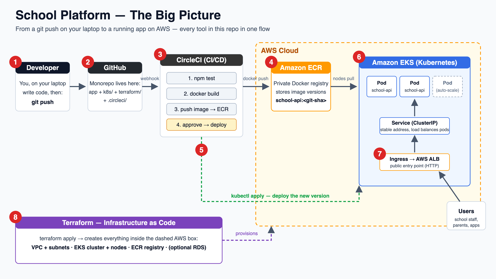
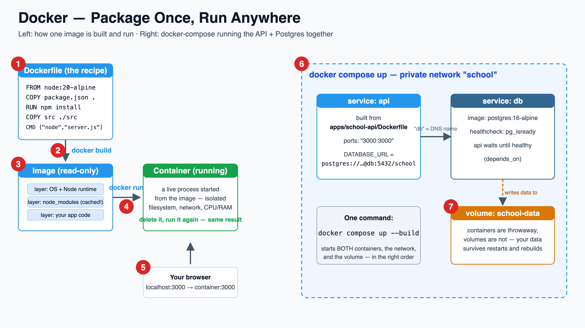
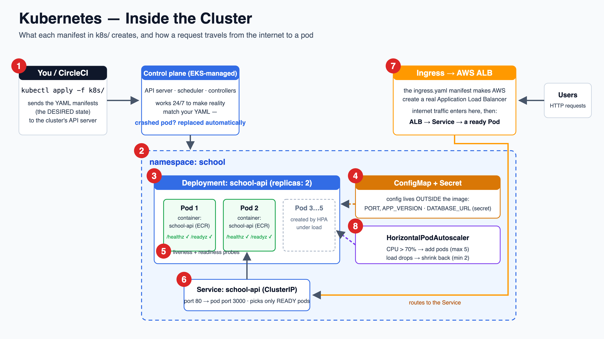
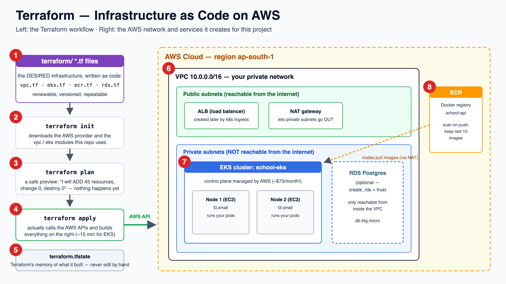
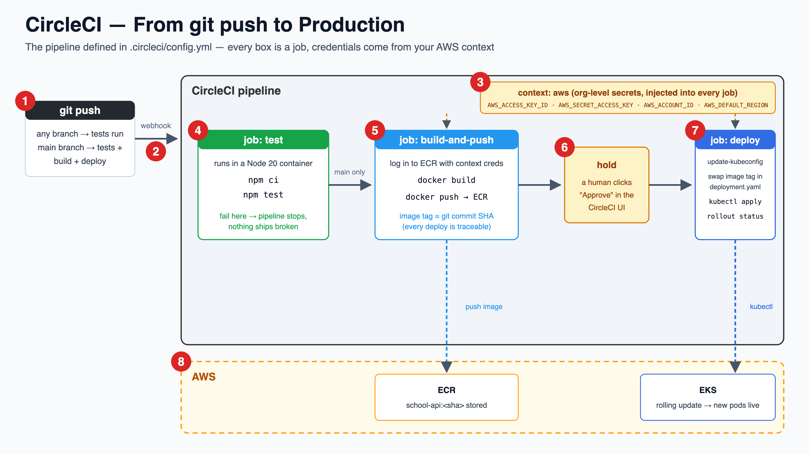
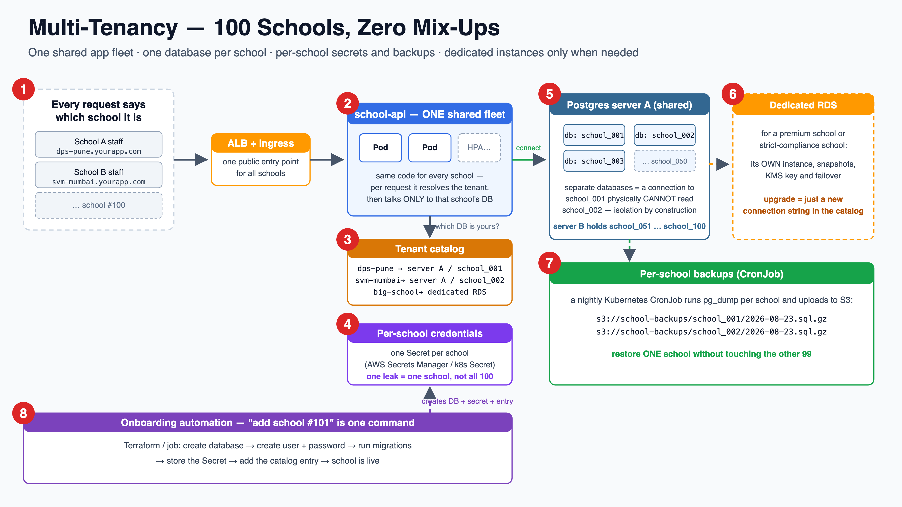

# 🏫 School Platform — Learn Docker, Kubernetes, Terraform, AWS & CircleCI

A **learning monorepo** built around one simple use case — a school management system
with **two services** (a Node.js REST API + a Python analytics API) — so that every
DevOps tool has a real job to do:

| Tool | What it does here | Folder |
|---|---|---|
| **Docker** | Packages the API into an image; runs it locally with Postgres | [apps/school-api/Dockerfile](apps/school-api/Dockerfile), [docker-compose.yml](docker-compose.yml) |
| **Kubernetes** | Runs the API with 2+ self-healing, auto-scaling pods | [k8s/](k8s/) |
| **Terraform** | Creates all AWS infrastructure from code | [terraform/](terraform/) |
| **AWS** | Hosts everything: VPC, EKS, ECR, (optional) RDS | created by Terraform |
| **CircleCI** | Tests → builds → pushes → deploys on every push to `main` | [.circleci/config.yml](.circleci/config.yml) |

🎬 **Video walkthrough (with narration):** [docs/video/walkthrough-4k.mp4](docs/video/walkthrough-4k.mp4) —
a 6-minute narrated 4K guided tour that steps through every numbered diagram below, highlighting
each step with a caption while a voice explains it. (Open the file on GitHub and it plays right in the browser.)

🔬 **New to all of this?** Read [docs/under-the-hood.md](docs/under-the-hood.md) — three more 4K
step-by-step diagrams explaining what *really* happens underneath: what `docker run` actually does,
how `kubectl apply` becomes a running pod, and the life of one HTTP request.

🎒 **Completely new to programming/DevOps?** Start with
[docs/before-you-start.md](docs/before-you-start.md) — the 7 foundations to learn *before* this
project (terminal, git, HTTP, YAML, …), each with a self-check and free resources. If the
self-checks pass, come straight back here.

> 🌐 **Interactive version on GitHub Pages:** the same guide exists as a web page with
> tick-off self-checks and a progress bar ([docs/index.html](docs/index.html)). To publish it:
> repo **Settings → Pages → Source: Deploy from a branch → Branch: `main`, folder: `/docs`** →
> Save. It then appears at `https://baluraut.github.io/claod-2026-eks-docker-terraform/`.
> (Note: GitHub Pages on a **private** repo requires a paid GitHub plan — either upgrade or
> make the repo public.)

> ⚠️ **This repo is for learning.** The AWS pieces cost real money while they exist
> (EKS ≈ $73/month + EC2 nodes + NAT gateway). Create them, play, and run
> `terraform destroy` the same day.

---

## Repo structure

```
cloud-real/
├── apps/
│   ├── school-api/          # Node.js/Express REST API (students, teachers)
│   │   ├── src/             # server.js + db.js (Postgres OR in-memory)
│   │   ├── test/            # tests CircleCI runs
│   │   └── Dockerfile       # multi-stage image build
│   └── school-analytics/    # Python/FastAPI service — aggregates data
│       ├── app/main.py      # calls school-api over the cluster network
│       ├── test/            # pytest suite (mocks the upstream)
│       └── Dockerfile       # python:3.12-slim, non-root
├── docker-compose.yml       # local: both APIs + Postgres in one command
├── k8s/                     # Kubernetes manifests (2 deployments, 2 services)
├── terraform/               # AWS infrastructure as code (VPC, EKS, 2× ECR, RDS)
├── .circleci/config.yml     # CI/CD pipeline (uses your AWS context)
└── docs/images/             # the numbered diagrams below (SVG + 4K PNG)
```

### The two services

| | school-api (Node.js) | school-analytics (Python) |
|---|---|---|
| Framework | Express | FastAPI |
| Owns data? | yes (Postgres or in-memory) | no — calls school-api |
| Cluster address | `http://school-api` | `http://school-analytics` |
| Public route (via ALB) | `/*` | `/analytics/*` |
| Example | `GET /students` | `GET /analytics/stats/students` |

`school-analytics` demonstrates **service-to-service communication**: it reaches the
Node API through its Kubernetes Service DNS name (`SCHOOL_API_URL=http://school-api`),
and the Ingress routes the public paths to the right service from one load balancer.

## Suggested learning path

1. **Run the app plain** — `cd apps/school-api && npm install && npm start` → http://localhost:3000
2. **Docker** — build the image, then `docker compose up --build` (section 2)
3. **Kubernetes locally** *(optional but recommended)* — apply `k8s/` to Docker Desktop's built-in cluster or minikube
4. **Terraform + AWS** — create ECR + EKS for real (section 4)
5. **CircleCI** — wire up the pipeline and ship on `git push` (section 5)

💻 **Steps 1–3 in full detail:** [docs/local-setup.md](docs/local-setup.md) — a complete local
setup guide (prerequisites, three levels with ✅ checks after each, ports table, troubleshooting).
Everything local, zero AWS cost.

---

# 1️⃣ The Big Picture



**What each number does:**

1. **Developer** — you write code on your laptop and run `git push`. That single command is the trigger for everything else in this diagram; you never copy files to a server by hand.
2. **GitHub** — the monorepo lives here. Application code, Kubernetes manifests, Terraform and the pipeline definition are all versioned together, so one commit describes the *entire* system.
3. **CircleCI** — GitHub notifies CircleCI on every push (webhook). CircleCI runs the pipeline: test → build the Docker image → push it → wait for your approval → deploy.
4. **Amazon ECR** — AWS's private Docker registry. Every image is tagged with the git commit SHA (`school-api:abc123`), so you always know exactly which code a running container came from.
5. **Deploy step** — CircleCI runs `kubectl apply`, telling the Kubernetes cluster "the desired image is now `school-api:abc123`". It's a *declaration*, not a script of manual steps.
6. **Amazon EKS** — the Kubernetes cluster pulls the new image from ECR and performs a **rolling update**: new pods start, pass health checks, old pods are removed. Zero downtime.
7. **Ingress → ALB** — an AWS Application Load Balancer is the public front door. It forwards user requests to the Service, which picks a healthy pod.
8. **Terraform** — everything inside the dashed AWS box (VPC, EKS, ECR, optionally RDS) was created by `terraform apply` from the code in [terraform/](terraform/) — no clicking in the AWS console.

---

# 2️⃣ Docker — Package Once, Run Anywhere



**What each number does:**

1. **Dockerfile** — the *recipe* for the image, in [apps/school-api/Dockerfile](apps/school-api/Dockerfile). It says: start from a small Node.js base, install dependencies, copy the code, define the start command. Ours is *multi-stage* so build tools never end up in the final image.
2. **`docker build`** — executes the recipe. Each instruction produces a **layer** that is cached: if only your source code changed, the slow `npm install` layer is reused. That's why we `COPY package.json` *before* copying the code.
3. **Image** — the frozen, read-only result. It contains the OS libraries, Node runtime, dependencies and your code — everything the app needs. It runs identically on your laptop, CircleCI, or an EKS node.
4. **`docker run`** — starts a **container**: a live, isolated process created from the image. Containers are disposable — delete one, start another, same result every time.
5. **Port mapping** — `-p 3000:3000` (or `ports:` in compose) connects your laptop's port 3000 to the container's port 3000, so http://localhost:3000 reaches the app.
6. **docker compose** — [docker-compose.yml](docker-compose.yml) runs **two** containers (API + Postgres) on a private network where services find each other by name — the API connects to the host `db`, no IP addresses needed. `depends_on` + healthcheck make the API wait until Postgres is actually ready.
7. **Volume** — containers lose their filesystem when removed, so Postgres writes to the named volume `school-data`, which survives `docker compose down` and rebuilds.

**Try it:**

```bash
docker compose up --build               # start both APIs + Postgres
curl localhost:3000/students            # Node API (seeded data)
curl localhost:8000/analytics/summary   # Python API, aggregating from the Node API
docker compose down                     # stop (add -v to also wipe the data volume)
```

---

# 3️⃣ Kubernetes — Inside the Cluster



**What each number does:**

1. **`kubectl apply -f k8s/`** — you (or CircleCI) send the YAML manifests to the cluster's API server. YAML describes the **desired state** ("2 replicas of this image"); you never start pods by hand.
2. **Namespace** — [namespace.yaml](k8s/namespace.yaml) creates `school`, a folder inside the cluster that isolates this project's resources from everything else.
3. **Deployment** — [deployment.yaml](k8s/deployment.yaml) is the heart of it: which image, 2 replicas, rolling-update strategy, resource requests/limits. The control plane works 24/7 to make reality match it — kill a pod and a replacement appears automatically (**self-healing**).
4. **ConfigMap + Secret** — [configmap.yaml](k8s/configmap.yaml) holds non-secret settings, [secret.example.yaml](k8s/secret.example.yaml) the sensitive `DATABASE_URL`. Config lives *outside* the image, so the same image runs in dev and prod with different values.
5. **Probes** — Kubernetes calls the app's `/healthz` (liveness: restart if hung) and `/readyz` (readiness: only send traffic when the DB connection works). See them implemented in [server.js](apps/school-api/src/server.js).
6. **Service** — [service.yaml](k8s/service.yaml) gives the pods one stable internal address (`school-api.school`) and load-balances across **only the ready** pods. Pods get new IPs constantly; the Service name never changes.
7. **Ingress → ALB** — [ingress.yaml](k8s/ingress.yaml) declares HTTP routing. On EKS (with the AWS Load Balancer Controller add-on) it provisions a real internet-facing Application Load Balancer.
8. **HPA** — [hpa.yaml](k8s/hpa.yaml) watches CPU: above 70% of requested CPU it adds pods (up to 5), when load drops it scales back (never below 2).

**Try it locally** (Docker Desktop → Settings → enable Kubernetes, or minikube):

```bash
docker build -t school-api:local apps/school-api
docker build -t school-analytics:local apps/school-analytics
kubectl apply -f k8s/namespace.yaml -f k8s/configmap.yaml
# point the deployments at the local images instead of ECR:
sed 's|IMAGE_PLACEHOLDER|school-api:local|' k8s/deployment.yaml | kubectl apply -f -
sed 's|ANALYTICS_IMAGE_PLACEHOLDER|school-analytics:local|' k8s/analytics-deployment.yaml | kubectl apply -f -
kubectl apply -f k8s/service.yaml -f k8s/analytics-service.yaml
kubectl -n school get pods -w                      # watch pods come up
kubectl -n school port-forward svc/school-api 8080:80 &
kubectl -n school port-forward svc/school-analytics 8081:80 &
curl localhost:8080/students
curl localhost:8081/analytics/summary              # Python calling Node, inside the cluster
```

---

# 4️⃣ Terraform — Infrastructure as Code on AWS



**What each number does:**

1. **`.tf` files** — [terraform/](terraform/) describes the *desired infrastructure* as code: a VPC ([vpc.tf](terraform/vpc.tf)), an EKS cluster ([eks.tf](terraform/eks.tf)), an ECR registry ([ecr.tf](terraform/ecr.tf)) and an optional RDS database ([rds.tf](terraform/rds.tf)). Code can be reviewed, versioned and re-applied — clicking in the console cannot.
2. **`terraform init`** — downloads the AWS provider and the community `vpc`/`eks` modules this repo uses. Run once per machine.
3. **`terraform plan`** — a dry run. Terraform compares your code with reality and prints exactly what it *would* create/change/destroy. Nothing happens yet — always read the plan.
4. **`terraform apply`** — actually calls the AWS APIs and builds everything (EKS takes ~15 minutes). Running apply twice changes nothing the second time — it's **idempotent**.
5. **State file** — `terraform.tfstate` is Terraform's memory of what it built and maps your code to real AWS resource IDs. Never edit it; in teams it lives in S3 with locking (see the commented backend in [versions.tf](terraform/versions.tf)).
6. **VPC** — your private network, split into **public subnets** (things allowed to face the internet: the ALB and the NAT gateway) and **private subnets** (everything else). The NAT gateway lets private machines reach *out* (e.g. pull images) without being reachable *from* the internet.
7. **EKS cluster** — AWS runs the Kubernetes control plane for you; your two `t3.small` EC2 worker nodes live in the **private** subnets and run the pods.
8. **ECR** — the Docker registry (with scan-on-push and a keep-last-10 lifecycle policy). RDS Postgres is there too but **off by default** (`create_rds = false`) to save money — the app happily runs in in-memory mode without it.

**Try it** (needs AWS CLI configured with an account you own):

```bash
cd terraform
terraform init
terraform plan                     # read what it will create!
terraform apply                    # ~15 min; type 'yes'
aws eks update-kubeconfig --region ap-south-1 --name school-eks
kubectl get nodes                  # your cluster is real

terraform destroy                  # 💸 when done for the day — ALWAYS
```

---

# 5️⃣ CircleCI — From `git push` to Production



**What each number does:**

1. **`git push`** — the only manual action. Any branch runs tests; only `main` continues to build and deploy (see `filters` in [.circleci/config.yml](.circleci/config.yml)).
2. **Webhook** — GitHub tells CircleCI about the push; CircleCI reads `.circleci/config.yml` from the repo and starts the pipeline.
3. **Context `balu-cicd`** — your CircleCI **context** (Organization Settings → Contexts) injects the AWS credentials into every job as environment variables: `AWS_ACCESS_KEY_ID`, `AWS_SECRET_ACCESS_KEY`, `AWS_ACCOUNT_ID`, `AWS_DEFAULT_REGION`. Secrets stay in CircleCI — never in the repo. The config references it as `context: balu-cicd`.
4. **Test jobs** — `test-node` (`npm ci` + `npm test`) and `test-python` (`pip install` + `pytest`) run **in parallel**, one per service. If either fails, the pipeline stops here — broken code can't reach production.
5. **`build-and-push` job** — logs in to ECR using the context credentials, builds the Docker image and pushes it tagged with the **git commit SHA** plus `latest`.
6. **`hold`** — a manual approval gate. The pipeline pauses until a human clicks **Approve** in the CircleCI UI — a common pattern for production deploys.
7. **`deploy-to-eks` job** — runs `aws eks update-kubeconfig` to authenticate to the cluster, replaces `IMAGE_PLACEHOLDER` in [k8s/deployment.yaml](k8s/deployment.yaml) with the exact image just built, runs `kubectl apply`, and waits for `kubectl rollout status` to confirm the new pods are live.
8. **Result on AWS** — the image version is stored in ECR, and EKS has rolled the deployment to it with zero downtime. Every deploy is traceable back to a commit.

**Setup checklist:**

1. Push this repo to GitHub and connect the project in CircleCI.
2. Make sure your `balu-cicd` context provides the 4 variables above.
3. Run `terraform apply` first — the pipeline needs the ECR repo and EKS cluster to exist.
4. Push to `main`, watch the pipeline, click **Approve**, then:
   `kubectl -n school get pods` 🎉

---

# 6️⃣ Multi-Tenancy — 100 Schools, Zero Mix-Ups

*The scaling plan: how this platform serves many schools with **one database per school**, so no
school's data can ever mix with another's — each with its own credentials and its own backups.*



**What each number does:**

1. **Tenant identity on every request** — each school gets its own subdomain (`dps-pune.yourapp.com`). The subdomain (or a JWT claim) tells the platform *which school* every single request belongs to. Nothing is ever ambiguous.
2. **One shared app fleet** — you do **not** run 100 copies of the app. The same `school-api` pods serve every school; per request they resolve the tenant and then talk *only* to that school's database. One deploy updates all 100 schools.
3. **Tenant catalog** — a small control-plane table mapping each school to its database location (`dps-pune → server A / school_001`). Moving a school to a bigger server is just an update here.
4. **Per-school credentials** — every school's database user + password lives in its own Secret (AWS Secrets Manager or a k8s Secret). If one credential ever leaks, one school is affected — not all 100.
5. **Database-per-school on shared Postgres servers** — the sweet spot: each school gets its **own database** (`school_001`, `school_002`, …) on a shared Postgres instance. A connection to one database *physically cannot* read another — isolation by construction, without paying for 100 idle servers. Server B takes schools 51–100; add servers as you grow.
6. **Dedicated instance when needed** — a premium school or one with strict compliance needs gets promoted to its **own RDS instance** with its own snapshots, KMS encryption key and failover. The app doesn't change — it's just a new connection string in the catalog.
7. **Per-school backups** — a nightly CronJob runs `pg_dump` *per school* and uploads to S3 under that school's prefix. "School #42 deleted everything, please restore" touches school #42 only.
8. **Onboarding automation** — "add school #101" is one command: create the database → create the user → run migrations → store the Secret → add the catalog entry. At 100 schools, this automation *is* the product.

> **Why not the alternatives?** One shared database with a `school_id` column is cheaper but one
> buggy query can leak data across schools. One RDS instance *per* school is the strongest isolation
> but costs $1,500+/month at 100 schools while most sit idle. Database-per-school on shared servers
> gives real isolation at a fraction of the cost — and lane 6 exists for the schools that need more.

---

## The images

Each diagram exists twice in [docs/images/](docs/images/):
- `*-4k.png` — 3840×2160 (4K) renders, embedded above
- `*.svg` — the vector originals; infinitely zoomable if you want even more detail

Diagrams 07–09 (the beginner "under the hood" series — docker run internals, the kubectl→pod
chain, and the life of one HTTP request) live in [docs/under-the-hood.md](docs/under-the-hood.md).

## API quick reference

**school-api (Node, port 3000):**

```
GET    /            service info        GET    /healthz     liveness
GET    /students    list students       GET    /readyz      readiness (checks DB)
POST   /students    {name, grade}       GET    /teachers    list teachers
DELETE /students/1                      POST   /teachers    {name, subject}
```

**school-analytics (Python, port 8000):**

```
GET /analytics/                  service info
GET /analytics/stats/students    student count per grade
GET /analytics/stats/teachers    teacher count per subject
GET /analytics/summary           totals + students-per-teacher ratio
GET /healthz  /readyz            probes (readyz checks the school-api upstream)
GET /docs                        FastAPI's built-in interactive API docs (Swagger UI)
```
