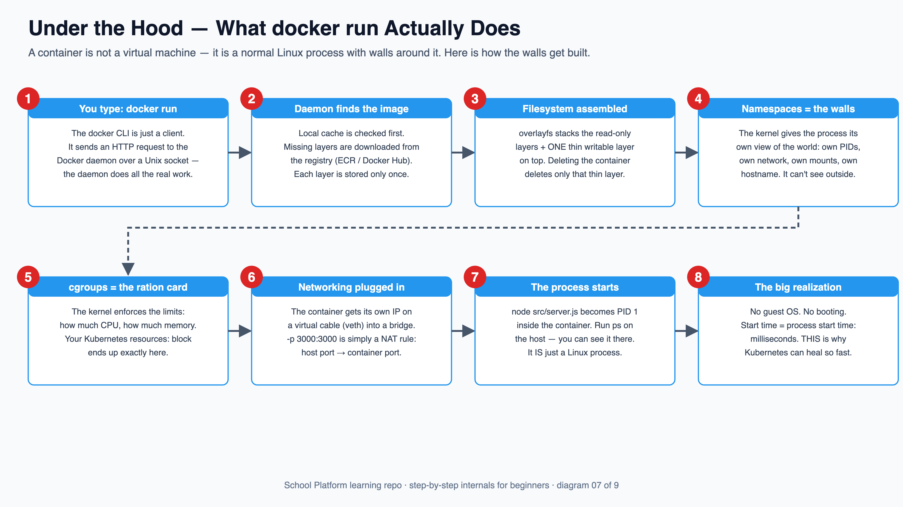
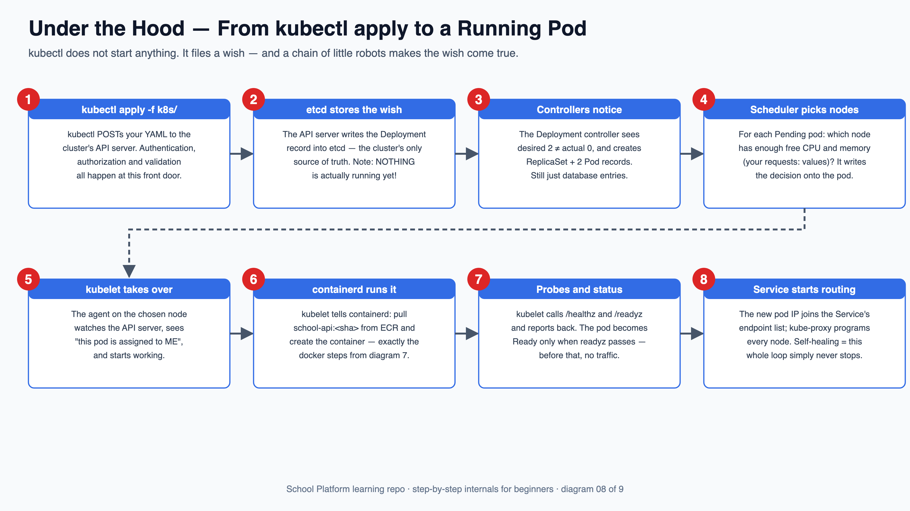
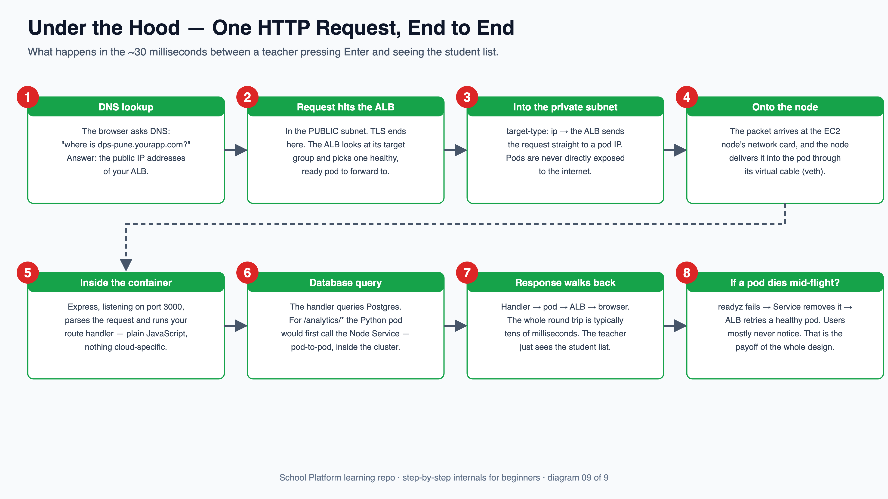

# 🔬 Under the Hood — What *Really* Happens, Step by Step

The main [README](../README.md) shows you **what to do**. This guide shows you **what happens
underneath** when you do it — in beginner language, one numbered step at a time.
Three moments of magic, demystified:

1. [What `docker run` actually does](#1--what-docker-run-actually-does)
2. [From `kubectl apply` to a running pod](#2--from-kubectl-apply-to-a-running-pod)
3. [One HTTP request, end to end](#3--one-http-request-end-to-end)

Each diagram is also available as an infinitely-zoomable SVG in [images/](images/).

---

## 1 — What `docker run` actually does

> **The one idea to keep:** a container is **not** a small virtual machine.
> It is a completely normal Linux process that the kernel has built walls around.



**The steps in words:**

1. **You type `docker run`** — the `docker` command is only a *client*. It sends an HTTP request to the Docker daemon (a background service) over a Unix socket. The daemon does all the real work — that's why Docker Desktop must be running.
2. **The daemon finds the image** — local cache first; any missing layers are downloaded from the registry. Layers are shared: ten images based on `node:20-alpine` store that base **once**.
3. **The filesystem is assembled** — overlayfs stacks the read-only image layers and puts **one thin writable layer** on top. The container sees one normal filesystem. Deleting a container only deletes that thin layer — the image is untouched.
4. **Namespaces build the walls** — the kernel gives the process its own *view* of the world: its own process list, own network interfaces, own mount table, own hostname. Inside, your app genuinely believes it has a machine to itself.
5. **cgroups enforce the ration card** — maximum CPU share, maximum memory. When Kubernetes later applies your `resources:` block, *this* is the mechanism it uses.
6. **Networking is plugged in** — the container gets its own IP on a virtual cable (a *veth pair*) into a bridge. `-p 3000:3000` is just a NAT rule: traffic to host port 3000 is forwarded to container port 3000.
7. **The process starts** — `node src/server.js` becomes PID 1 *inside* the container. On the host it's visible as an ordinary process.
8. **The big realization** — no guest OS, no booting. Starting a container ≈ starting a process ≈ milliseconds. This speed is exactly what makes Kubernetes' self-healing practical.

**See it yourself:**

```bash
docker compose up -d --build
docker ps                                   # your containers = running processes
docker exec -it cloud-real-api-1 ps aux     # the process list INSIDE the walls (tiny!)
docker history school-api                   # the image layers, one per Dockerfile line
docker inspect cloud-real-api-1 | grep -A3 '"Memory"'   # the cgroup limits
```

---

## 2 — From `kubectl apply` to a running pod

> **The one idea to keep:** `kubectl` starts nothing. It files a *wish* into a database,
> and a chain of little robots — each watching for its own kind of work — makes the wish come true.



**The steps in words:**

1. **`kubectl apply -f k8s/`** — kubectl POSTs your YAML to the cluster's **API server**. Authentication ("who are you?"), authorization ("may you?") and validation ("is this valid YAML for a Deployment?") all happen at this front door.
2. **etcd stores the wish** — the API server writes the Deployment record into **etcd**, the cluster's only source of truth. Important: at this moment **nothing is running yet**. You've written a wish into a database, that's all.
3. **Controllers notice** — the Deployment controller constantly compares *desired* vs *actual*. It sees "desired 2, actual 0" and creates a ReplicaSet and 2 Pod records. Still just database entries!
4. **The scheduler picks nodes** — for every Pending pod it asks: which node has enough free CPU/memory (this is where your `requests:` matter)? It writes the chosen node's name onto the pod.
5. **kubelet takes over** — every node runs an agent called kubelet that watches the API server. The kubelet on the chosen node sees "this pod is assigned to *me*" and starts working.
6. **containerd runs it** — kubelet instructs containerd (the container runtime): pull `school-api:<sha>` from ECR, create the container. From here it's *exactly* the docker-run story from diagram 7 — layers, namespaces, cgroups.
7. **Probes and status** — kubelet starts calling your app's `/healthz` and `/readyz` and reports results back to the API server. The pod only becomes **Ready** when `/readyz` passes.
8. **The Service starts routing** — the new pod's IP joins the Service's endpoint list, and kube-proxy reprograms the routing rules on every node. And here is self-healing in one sentence: **this watch-compare-fix loop never stops** — kill a pod and steps 3–8 simply happen again, no human involved.

**See it yourself** (with a local cluster, e.g. Docker Desktop's Kubernetes):

```bash
kubectl -n school get events --sort-by=.lastTimestamp   # the whole story, narrated live
kubectl -n school get pods -o wide                       # which node each pod landed on
kubectl -n school describe pod -l app=school-api         # scheduling, pulling, probes
kubectl -n school get endpointslices                     # the Service's routing list
kubectl -n school delete pod -l app=school-api           # kill them — watch them return!
```

---

## 3 — One HTTP request, end to end

> **The one idea to keep:** every layer you built (ALB, Service, probes, private subnets)
> plays its part in the ~30 milliseconds of a single page load.



**The steps in words:**

1. **DNS lookup** — the browser asks DNS "where is `dps-pune.yourapp.com`?" and gets back the public IP addresses of your ALB.
2. **The request hits the ALB** — in the **public subnet**. TLS terminates here. The ALB consults its target group and picks one **healthy, ready** pod.
3. **Into the private subnet** — with `target-type: ip` the ALB forwards straight to the pod's IP. Your pods are never directly exposed to the internet; the ALB is the only public door.
4. **Onto the node** — the packet arrives at the EC2 node's network interface, and the node delivers it into the pod through the pod's virtual cable (veth — the same one from diagram 7, step 6).
5. **Inside the container** — Express, listening on port 3000, parses the request and runs your route handler. At this point it's plain JavaScript — nothing cloud-specific at all.
6. **Database query** — the handler queries Postgres. For an `/analytics/*` request, the Python pod would first call the Node Service (`http://school-api`) — pod-to-pod traffic that never leaves the cluster.
7. **The response walks back** — handler → pod → ALB → browser. Typically tens of milliseconds in total. The teacher just sees the student list.
8. **And if a pod dies mid-flight?** — its `/readyz` fails, the Service pulls it from rotation, the ALB retries a healthy target, and Kubernetes replaces the dead pod in the background (diagram 8's loop). Users mostly never notice. **That is the payoff of the entire design.**

**See it yourself:**

```bash
# locally with compose (no ALB, but same app path):
time curl -s localhost:3000/students >/dev/null          # measure a round trip
time curl -s localhost:8000/analytics/summary >/dev/null # includes the pod-to-pod hop

# on EKS:
kubectl -n school get ingress                            # the ALB's public DNS name
kubectl -n school get endpointslices                     # exactly which pod IPs the ALB can hit
```

---

### Where next?

- Back to the [main README](../README.md) for the hands-on learning path.
- The [multi-tenancy section](../README.md#6️⃣-multi-tenancy--100-schools-zero-mix-ups) shows how this scales to 100 schools.
