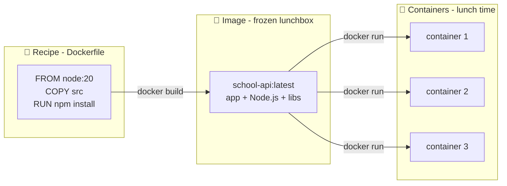

# 🍱 Lesson 01 — Containers & Images: the packed lunchbox

**📍 You are here:** Lesson **01** of 13 · Next branch: `lesson-02-pods`

---

## 📦 What's in this branch

This branch adds the very first lesson: **what a container is**, and what an
**image** is — because Kubernetes' whole job is running containers, so nothing
else makes sense until this does. Real files this lesson uses:

- [apps/school-api/Dockerfile](../../apps/school-api/Dockerfile) — recipe for the Node.js API image
- [apps/school-analytics/Dockerfile](../../apps/school-analytics/Dockerfile) — recipe for the Python image
- [docker-compose.yml](../../docker-compose.yml) — runs both containers + Postgres locally

## 🧒 Explain like I'm 5

Imagine your mom packs you a **lunchbox** 🍱. Inside is *everything you need*:
rice, curry, a spoon, a napkin. It doesn't matter whose house you open it in —
your lunch is exactly the same, because everything came **inside the box**.

A **container** is a lunchbox for a program. Inside is the app *plus everything
it needs* — Node.js, libraries, config. So it runs **exactly the same** on your
laptop, your friend's laptop, and a giant AWS server. No more "but it works on
my machine!" 😤

- The **image** = the *recipe + packed box on the shelf* (frozen, ready).
- The **container** = the box *opened and being eaten* (running).
- The **Dockerfile** = the *recipe card* mom followed to pack it.

You can make 100 identical lunchboxes from one recipe. That's why one image can
run as 100 identical containers.

## 🗺️ Diagram



## ❓ What

- A **container** is an isolated process with its own filesystem, network view
  and dependencies — much lighter than a virtual machine (it shares the host's
  Linux kernel instead of booting its own OS).
- An **image** is the read-only template a container starts from, built in
  layers from a **Dockerfile**.
- A **registry** (like AWS ECR here) is the shelf where images are stored and
  pulled from.

## 🤔 Why

Without containers: "install Node 20, Postgres 16, set these 12 env vars…" and
every machine drifts apart. With containers: **build once, run anywhere,
identically**. Kubernetes exists to run *lots* of containers across *lots* of
machines — so containers are the atoms of everything that follows.

## 🔧 How (in this repo)

Open [apps/school-api/Dockerfile](../../apps/school-api/Dockerfile):

1. `FROM node:20-alpine` — start from a small base lunchbox that already has Node.
2. `COPY` + `RUN npm ci` — put the app and its libraries inside.
3. Multi-stage build — the final image keeps only what's needed to *run* (small = fast to ship).
4. `CMD` — what to do when the box is opened ("start the server").

[docker-compose.yml](../../docker-compose.yml) then runs **three** containers
together on your laptop: `school-api`, `school-analytics`, and `postgres`.

## 🧪 Try it

```bash
# Build the image (bake the lunchbox) — needs Docker Desktop running
docker build -t school-api:v1 apps/school-api

# Run one container from it (open the box)
docker run --rm -p 3000:3000 school-api:v1

# In another terminal — it's alive:
curl http://localhost:3000/healthz

# Or run the WHOLE lunch table (both APIs + Postgres):
docker compose up
```

## ⏭️ Next

A container never runs "naked" in Kubernetes — it always rides inside a **Pod**.

```bash
git checkout lesson-02-pods
```
