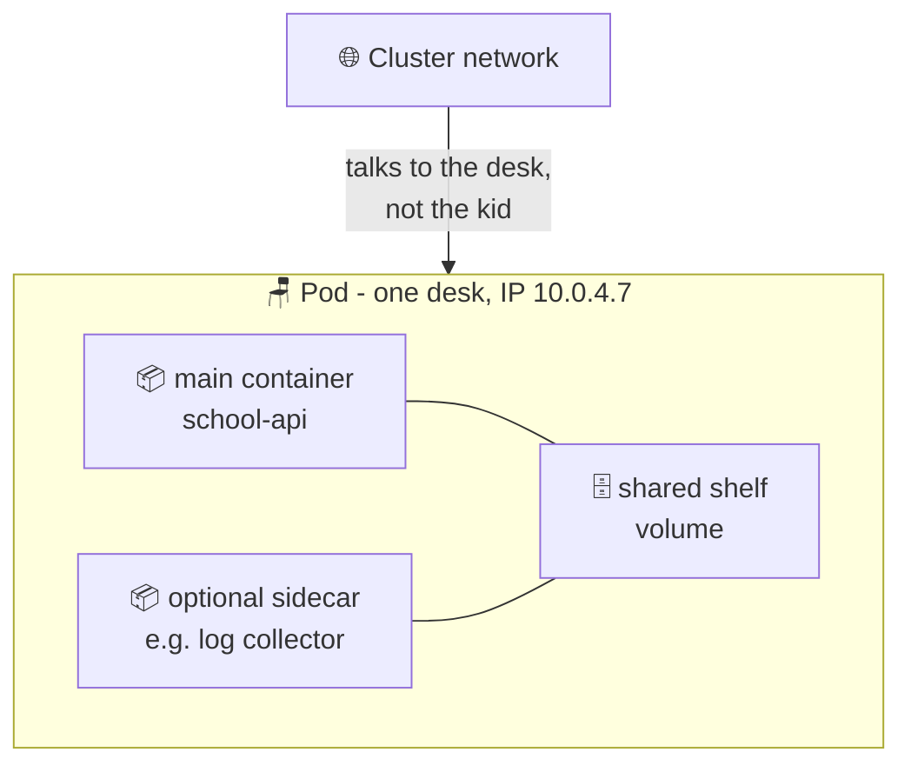

# 🪑 Lesson 02 — Pods: one school desk

**📍 You are here:** Lesson **02** of 13 · Previous: `lesson-01-containers` · Next: `lesson-03-deployments`

---

## 📦 What's in this branch

Everything from lesson 01, **plus** this lesson: the **Pod** — the smallest
thing Kubernetes ever runs. Real files this lesson uses:

- [k8s/deployment.yaml](../../k8s/deployment.yaml) — look at the `template:` part — that's a **pod blueprint**

## 🧒 Explain like I'm 5

In school, you never just float in the air — you sit at a **desk** 🪑. The desk
gives you a place: your chair, your name tag, your little shelf. Sometimes two
best friends share one double desk and can whisper to each other instantly.

A **Pod** is a desk for your container. Kubernetes never runs a container
directly — it always gives it a desk first. The desk has:

- **one address** (its own IP) — like the desk's name tag,
- **shared storage** — the shelf under the desk,
- room for a **helper container** sometimes — the friend sharing the double desk
  (people call this a "sidecar").

And here's the important part: desks are **replaceable**. If your desk breaks,
the school doesn't repair it — it throws it away and gives you a **new desk with
a new name tag**. Pods are the same: they are *cattle, not pets*. They come and
go; nobody cries.

## 🗺️ Diagram



## ❓ What

- A **Pod** = one or more containers that always live together on the same
  machine, sharing one IP address and optional volumes.
- 99% of pods hold **one** container (ours do). Multi-container pods are for
  tight helpers (sidecars), not for stacking your whole app in one pod.
- Pods are **ephemeral**: they get created, they die, replacements get a *new*
  name and a *new* IP. Never point at a pod's IP directly (lesson 04 fixes this).

## 🤔 Why

Why not run containers directly? Because Kubernetes needs one common wrapper to
give *any* container an IP, storage, health-checking and a place on a machine.
The Pod is that wrapper — the standard desk every program sits at, so the school
can manage a Node.js app and a Python app the exact same way.

## 🔧 How (in this repo)

We never write a standalone Pod file — and that's a real lesson in itself:
in [k8s/deployment.yaml](../../k8s/deployment.yaml) the section under
`template:` **is** the pod blueprint:

```yaml
template:              # ← the pod blueprint ("desk design")
  metadata:
    labels:
      app: school-api  # ← sticker on the desk (lesson 03 explains why)
  spec:
    containers:
      - name: school-api
        image: IMAGE_PLACEHOLDER
        ports:
          - containerPort: 3000
```

The Deployment (lesson 03) stamps out desks from this design.

## 🧪 Try it

With any local cluster (Docker Desktop's built-in Kubernetes, `minikube start`,
or `kind create cluster`):

```bash
# Run a single throwaway pod by hand — the ONLY time you'll do this manually:
kubectl run hello --image=nginx --restart=Never

kubectl get pods -o wide     # see its IP and which node it sits on
kubectl describe pod hello   # the pod's full report card
kubectl delete pod hello     # throw the desk away — and notice:
kubectl get pods             # ...nothing brings it back. That's lesson 03's job.
```

## ⏭️ Next

A lone pod that dies **stays dead**. Who keeps the right number of desks alive
at all times? The **Deployment** — the strict class monitor.

```bash
git checkout lesson-03-deployments
```
