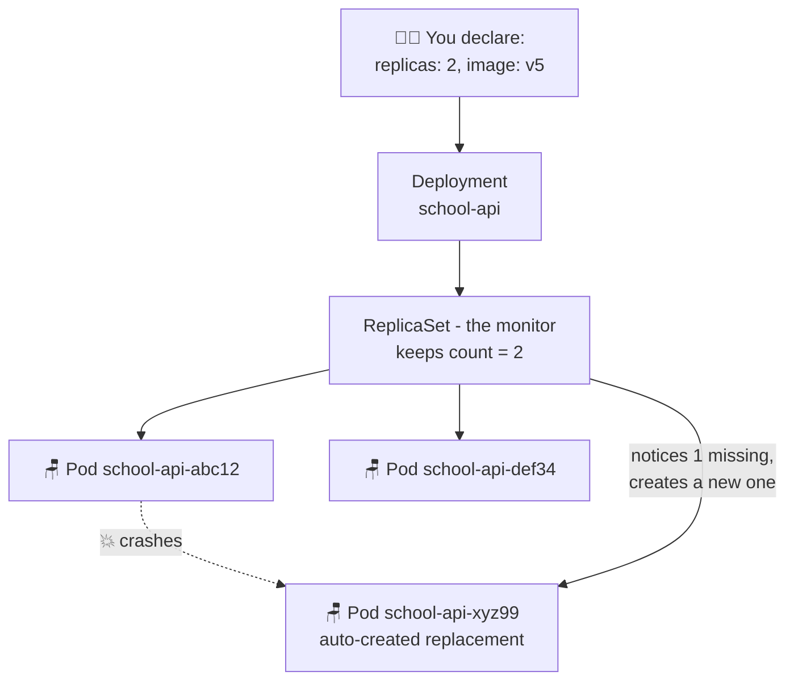

# 🧑‍🏫 Lesson 03 — Deployments: the strict class monitor

**📍 You are here:** Lesson **03** of 13 · Previous: `lesson-02-pods` · Next: `lesson-04-services`

---

## 📦 What's in this branch

Lessons 01–02, **plus**: the **Deployment** — the object that keeps your pods
alive, in the right number, running the right version. Real files:

- [k8s/deployment.yaml](../../k8s/deployment.yaml) — the Node API Deployment (2 replicas)
- [k8s/analytics-deployment.yaml](../../k8s/analytics-deployment.yaml) — same pattern, Python service

## 🧒 Explain like I'm 5

The teacher tells the **class monitor**: *"There must ALWAYS be **2 kids**
watering the plants. Always. I don't care how."* 🧑‍🏫🌱

The monitor takes this seriously:

- A kid goes home sick? → monitor **instantly sends a new kid**. No questions.
- Someone sneaks in a 3rd kid? → monitor **sends one back**. Exactly 2. Always.
- Teacher changes the rule to "3 kids"? → monitor adds one.

That's a **Deployment**. You don't tell Kubernetes *what to do* — you tell it
*what the world should look like* ("2 copies of school-api, version v5"), and
the monitor works **forever** to keep reality matching your wish. This is the
single biggest idea in Kubernetes: **desired state**. You declare; it reconciles.

## 🗺️ Diagram



## ❓ What

- A **Deployment** declares: which **image**, how many **replicas**, how to
  **update** them. Under the hood it creates a **ReplicaSet** (the actual
  counter/monitor), which creates the **Pods**.
- **Labels & selectors** are the glue: the ReplicaSet claims "my pods are the
  ones labeled `app: school-api`" — that's the sticker from lesson 02.
- Deployment → ReplicaSet → Pods. You edit the Deployment; the rest follows.

## 🤔 Why

Lesson 02 ended with a dead pod staying dead. Real apps must **self-heal** at
3 AM without you. The Deployment is why Kubernetes people sleep well: a crashed
pod, a rebooted node, a killed container — the monitor replaces them all,
because your YAML said "there shall be 2". It also unlocks **zero-downtime
upgrades** (lesson 11) by swapping pods one at a time.

## 🔧 How (in this repo)

Open [k8s/deployment.yaml](../../k8s/deployment.yaml):

```yaml
spec:
  replicas: 2                 # ← the promise: ALWAYS 2 desks
  selector:
    matchLabels:
      app: school-api         # ← "my pods wear this sticker"
  template:                   # ← lesson 02's pod blueprint
    metadata:
      labels:
        app: school-api       # ← the sticker itself (must match!)
```

Note `image: IMAGE_PLACEHOLDER` — CircleCI stamps in the real ECR image tag at
deploy time (see [.circleci/config.yml](../../.circleci/config.yml)).

## 🧪 Try it

```bash
kubectl apply -f k8s/namespace.yaml          # the room first (lesson 05 explains)
kubectl apply -f k8s/configmap.yaml          # config (lesson 06 explains)

# For local play, use a public image instead of IMAGE_PLACEHOLDER:
sed 's|IMAGE_PLACEHOLDER|nginxdemos/hello:plain-text|; s|containerPort: 3000|containerPort: 80|' \
  k8s/deployment.yaml | kubectl apply -f -

kubectl -n school get pods                   # 2 pods, names like school-api-xxxxx

# 😈 Now be the chaos: delete one pod...
kubectl -n school delete pod -l app=school-api --field-selector=status.phase=Running --wait=false
kubectl -n school get pods -w                # ...watch the monitor replace it in seconds!  Ctrl+C to stop
```

## ⏭️ Next

Pods now heal themselves — but their names and IPs change every time. How does
anyone *find* them reliably? The **Service** — the school reception desk.

```bash
git checkout lesson-04-services
```
