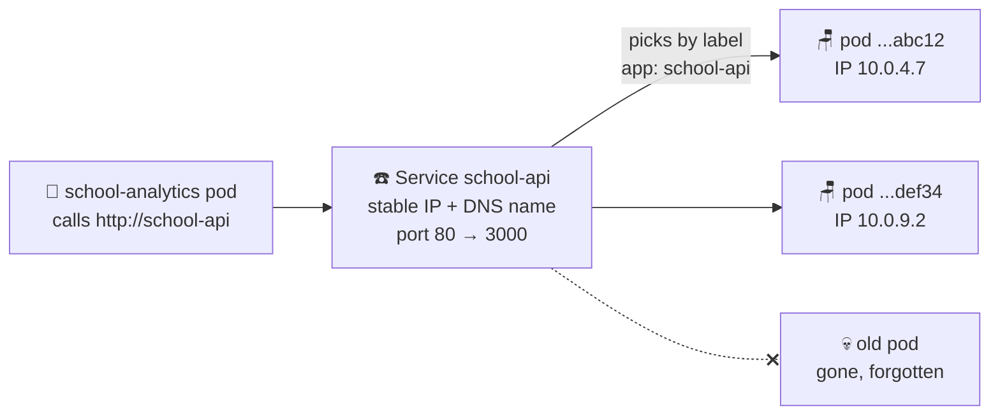

# ☎️ Lesson 04 — Services: the school reception desk

**📍 You are here:** Lesson **04** of 13 · Previous: `lesson-03-deployments` · Next: `lesson-05-namespaces`

---

## 📦 What's in this branch

Lessons 01–03, **plus**: the **Service** — one stable name and address in front
of ever-changing pods. Real files:

- [k8s/service.yaml](../../k8s/service.yaml) — stable address for the Node API pods
- [k8s/analytics-service.yaml](../../k8s/analytics-service.yaml) — stable address for the Python pods
- [k8s/analytics-deployment.yaml](../../k8s/analytics-deployment.yaml) — see `SCHOOL_API_URL`: one service *calling another by name*

## 🧒 Explain like I'm 5

You want to talk to "someone from Class 3B" at school. Do you memorize where
every kid is sitting today? No! Kids move desks, go home sick, new kids join…
you'd go crazy. 🤪

Instead, you call the **reception desk** ☎️. The school has ONE phone number
that **never changes**. Reception always knows which kids from 3B are present
*right now*, and connects you to one of them — a different kid each time, and
that's fine, any of them can help you.

A **Service** is that reception desk:

- **One name forever**: `school-api` — even while pods behind it are born and die.
- **Finds current pods** by their label sticker (`app: school-api`).
- **Spreads calls** across them — free load balancing!

## 🗺️ Diagram



## ❓ What

- A **Service** gives a set of pods (chosen by **label selector**) one stable
  **virtual IP** and one **DNS name**:
  `school-api.school.svc.cluster.local` (short form inside the namespace: just `school-api`).
- **`type: ClusterIP`** (ours) = reachable only *inside* the cluster. Other
  types: `NodePort` (opens a port on every machine), `LoadBalancer` (asks the
  cloud for a public IP). External traffic is lesson 10's job.
- `port: 80` is what callers dial; `targetPort: 3000` is where the container
  actually listens. Reception forwards the call.

## 🤔 Why

Lesson 03 made pods disposable — new pod, new IP, every time. Hard-coding pod
IPs would break hourly. The Service **decouples "who I want to talk to" from
"where they are right now"** — the same reason phones have contact names, not
memorized numbers. It's also how our two apps find each other: the Python
service just calls `http://school-api` and Kubernetes DNS does the rest.

## 🔧 How (in this repo)

[k8s/service.yaml](../../k8s/service.yaml):

```yaml
spec:
  type: ClusterIP
  selector:
    app: school-api      # ← same sticker the Deployment puts on pods
  ports:
    - port: 80           # ← callers dial 80...
      targetPort: 3000   # ← ...reception forwards to the container's 3000
```

And the payoff in [k8s/analytics-deployment.yaml](../../k8s/analytics-deployment.yaml):

```yaml
env:
  - name: SCHOOL_API_URL
    value: "http://school-api"   # ← a NAME, not an IP. DNS + Service do the rest.
```

## 🧪 Try it

```bash
kubectl apply -f k8s/service.yaml
kubectl -n school get svc                      # see the stable ClusterIP

kubectl -n school get endpointslices           # the live list reception keeps:
                                               # exactly your current pod IPs!

# Call the service BY NAME from a scratch pod inside the cluster:
kubectl -n school run tester --rm -it --image=curlimages/curl --restart=Never \
  -- curl -s http://school-api

# Delete a pod (lesson 03 chaos!) and check endpointslices again —
# reception updated its list all by itself.
```

## ⏭️ Next

Everything so far lives in a namespace called `school` — what IS that?

```bash
git checkout lesson-05-namespaces
```
