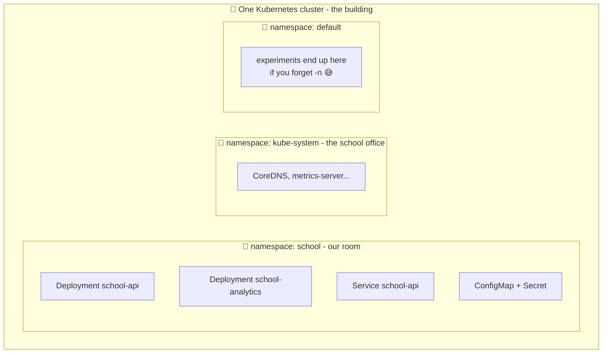

# 🚪 Lesson 05 — Namespaces: separate classrooms

**📍 You are here:** Lesson **05** of 13 · Previous: `lesson-04-services` · Next: `lesson-06-configmaps-secrets`

---

## 📦 What's in this branch

Lessons 01–04, **plus**: the **Namespace** — how one cluster stays tidy when
many teams and projects share it. Real file:

- [k8s/namespace.yaml](../../k8s/namespace.yaml) — the 6-line file everything else lives inside

## 🧒 Explain like I'm 5

A school building has many **classrooms** 🚪. Class 3A and Class 3B can BOTH
have a kid named "Aarav" — no problem! Inside 3A, you just say "Aarav" and
everyone knows who you mean. From another room you'd say "Aarav *from 3B*".

Each room also has its own notice board, its own supplies cupboard, and the
teacher can set room rules ("3A gets at most 30 kids").

A **Namespace** is a classroom inside the Kubernetes building:

- Two teams can both have a service called `api` — in *different* rooms.
- Deleting a room throws away everything in it — one clean sweep.
- The principal can put limits per room: "this project gets max 10 CPUs."

Our room is called **`school`**, and every object in this repo lives in it.

## 🗺️ Diagram



## ❓ What

- A **Namespace** is a named partition of one cluster. Names of most objects
  must be unique *within* a namespace, not across the cluster.
- Built-in rooms: `default` (where things land if you don't choose),
  `kube-system` (Kubernetes' own machinery — the school office).
- Namespaces can carry **quotas** (max CPU/RAM per room) and **access rules**
  (lesson 13 touches RBAC: "only team A may enter room A").
- DNS ties in: `school-api` works inside the room; from another room you say
  the full name — `school-api.school.svc.cluster.local` ("Aarav from 3B").

## 🤔 Why

One cluster is expensive (remember: EKS ≈ $73/month before nodes!) — so teams
**share** clusters. Without rooms you'd get name collisions, accidental
deletions of other people's stuff, and no way to say "staging may not eat all
the CPU". Namespaces give isolation-without-more-clusters. They're also a
clean blast radius: `kubectl delete namespace school` removes *everything* in
this project, and only this project.

## 🔧 How (in this repo)

[k8s/namespace.yaml](../../k8s/namespace.yaml) is tiny but must be applied **first**
(a room must exist before you put desks in it):

```yaml
apiVersion: v1
kind: Namespace
metadata:
  name: school
```

Then *every other manifest* pins itself to the room with
`metadata.namespace: school`, and every kubectl command needs `-n school` —
that's why you keep seeing it in these lessons.

## 🧪 Try it

```bash
kubectl apply -f k8s/namespace.yaml
kubectl get namespaces                       # school, default, kube-system...

kubectl -n school get all                    # our room's contents
kubectl -n kube-system get pods              # peek into the school office 👀

# Same name, two rooms — totally legal:
kubectl create namespace room-b
kubectl -n room-b create deployment api --image=nginx
kubectl -n school get deploy; kubectl -n room-b get deploy

# Clean sweep of the experiment room:
kubectl delete namespace room-b
```

## ⏭️ Next

Our pods need settings (port numbers) and secrets (database passwords) — and
baking those into the image would be like laminating the lunch menu into the
lunchbox. Enter **ConfigMaps & Secrets**.

```bash
git checkout lesson-06-configmaps-secrets
```
