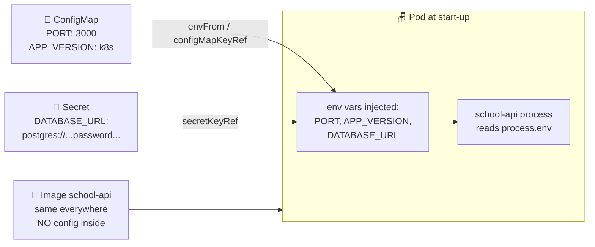

# 🔑 Lesson 06 — ConfigMaps & Secrets: notice board vs locker key

**📍 You are here:** Lesson **06** of 13 · Previous: `lesson-05-namespaces` · Next: `lesson-07-health-probes`

---

## 📦 What's in this branch

Lessons 01–05, **plus**: **ConfigMaps** (plain settings) and **Secrets**
(sensitive settings) — configuration that lives *outside* the image. Real files:

- [k8s/configmap.yaml](../../k8s/configmap.yaml) — PORT, APP_VERSION
- [k8s/secret.example.yaml](../../k8s/secret.example.yaml) — DATABASE_URL template (copy → `secret.yaml`, git-ignored)
- [k8s/deployment.yaml](../../k8s/deployment.yaml) — where the pod *reads* both

## 🧒 Explain like I'm 5

Two kinds of information at school:

1. **The notice board** 📌 — "Lunch at 12:30", "Sports day Friday". Public!
   Anyone may read it, and the teacher can change it without rebuilding the
   school. That's a **ConfigMap**.

2. **Your locker key** 🔑 — you do NOT pin your locker key to the notice board!
   It's kept carefully, given only to *you*, and nobody photocopies it into the
   class magazine. That's a **Secret**.

And the golden rule: **neither goes inside the lunchbox** 🍱. If the lunch menu
were laminated *inside* every lunchbox (image), changing lunch time would mean
re-packing 100 boxes. Keep settings on the wall, keys in pockets — and the same
lunchbox works in dev, staging and production.

## 🗺️ Diagram



## ❓ What

- **ConfigMap** = key→value pairs of NON-secret config, injected into pods as
  env vars (or mounted as files).
- **Secret** = same idea for sensitive values. Stored base64-encoded (that's
  *encoding*, not encryption!) and access-controllable; in real production you
  add encryption-at-rest or a manager like AWS Secrets Manager.
- Pods reference them by name — change the config, restart the pods, same image.

## 🤔 Why

The **same image** must run on your laptop (fake DB), in staging, and in prod
(real RDS) — only the *settings* differ. Separating config from code is rule #1
of [twelve-factor apps](https://12factor.net/config). And secrets need a
*different* door than config: you happily `git commit` a port number; you never
commit a database password. That's exactly why `secret.yaml` is **git-ignored**
here and only `secret.example.yaml` (with `CHANGE_ME`) is in the repo.

## 🔧 How (in this repo)

[k8s/configmap.yaml](../../k8s/configmap.yaml) holds the plain values. Then
[k8s/deployment.yaml](../../k8s/deployment.yaml) wires both into the pod:

```yaml
envFrom:
  - configMapRef:                 # 📌 the whole notice board at once
      name: school-api-config     #    (every key becomes an env var)
env:
  - name: DATABASE_URL
    valueFrom:
      secretKeyRef:               # 🔑 one key from the locker
        name: school-api-secrets
        key: DATABASE_URL
        optional: true            # no secret? app falls back to in-memory mode
```

The app itself just reads `process.env.PORT` — it has no idea Kubernetes exists.

## 🧪 Try it

```bash
kubectl apply -f k8s/configmap.yaml

# Make your real (git-ignored) secret from the example:
cp k8s/secret.example.yaml k8s/secret.yaml   # edit the password inside
kubectl apply -f k8s/secret.yaml

kubectl -n school get configmap school-api-config -o yaml   # readable 📌
kubectl -n school get secret school-api-secrets -o yaml     # base64 gibberish 🔑

# Prove base64 is NOT encryption:
kubectl -n school get secret school-api-secrets \
  -o jsonpath='{.data.DATABASE_URL}' | base64 -d; echo

# Change config → roll pods → same image, new settings:
kubectl -n school rollout restart deployment school-api
```

## ⏭️ Next

Pods run — but are they *healthy*? How does Kubernetes know a pod is frozen, or
not ready yet? **Probes** — the teacher's two questions.

```bash
git checkout lesson-07-health-probes
```
