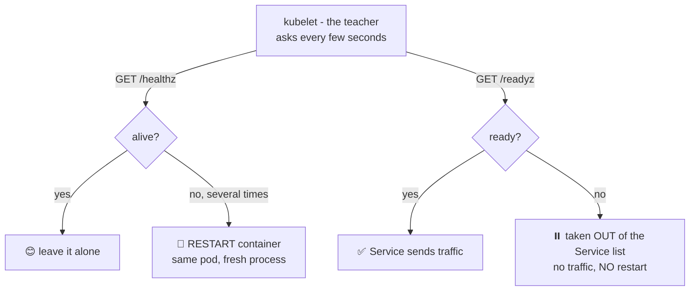

# 🙋 Lesson 07 — Health probes: "Are you awake? Are you ready?"

**📍 You are here:** Lesson **07** of 13 · Previous: `lesson-06-configmaps-secrets` · Next: `lesson-08-resources`

---

## 📦 What's in this branch

Lessons 01–06, **plus**: **liveness** and **readiness** probes — how Kubernetes
tells a healthy pod from a zombie. Real file:

- [k8s/deployment.yaml](../../k8s/deployment.yaml) — `livenessProbe` (`/healthz`) and `readinessProbe` (`/readyz`)

## 🧒 Explain like I'm 5

The teacher walks around the class and asks each kid **two different questions**:

1. **"Are you awake?"** 😴 — If a kid fell asleep face-down on the desk and
   doesn't answer *several times in a row*, the teacher sends them to the nurse
   and brings in a fresh kid. (Harsh school. Very effective.)
   → That's the **liveness probe**: no answer = **restart the container**.

2. **"Are you ready to answer questions?"** 🙋 — A kid who just came back from
   PE, still tying shoelaces, is awake but *not ready*. The teacher simply
   doesn't call on them until they raise their hand.
   → That's the **readiness probe**: not ready = **no traffic for you** (the
   Service from lesson 04 skips you), but no restart either.

Two questions, two very different consequences. Mixing them up is one of the
most common Kubernetes mistakes!

## 🗺️ Diagram



## ❓ What

- **Liveness probe** — "is the process stuck beyond saving?" Fails repeatedly →
  kubelet restarts the container. Cure for deadlocks and frozen apps.
- **Readiness probe** — "can you serve requests *right now*?" Fails → pod is
  removed from the Service's endpoint list until it passes again. Cure for
  "still starting up" and "my database is briefly unreachable".
- Probes can be `httpGet` (ours), `tcpSocket`, or `exec` a command. Knobs:
  `initialDelaySeconds` (grace period after start), `periodSeconds` (how often),
  `failureThreshold` (how many misses before acting).
- There's also a **startup probe** for very slow starters — not needed here.

## 🤔 Why

Without probes, Kubernetes only notices a container that **exits**. A process
that's alive-but-frozen would keep receiving traffic forever. Probes are also
what makes **zero-downtime rollouts** (lesson 11) work: a new pod gets traffic
only after `/readyz` says yes — so a bad build that can't start never receives
a single request. Self-healing (lesson 03) + probes = the cluster runs itself.

## 🔧 How (in this repo)

In [k8s/deployment.yaml](../../k8s/deployment.yaml):

```yaml
livenessProbe:
  httpGet: { path: /healthz, port: 3000 }
  initialDelaySeconds: 5     # let it boot before judging
  periodSeconds: 10          # ask every 10s
readinessProbe:
  httpGet: { path: /readyz, port: 3000 }
  initialDelaySeconds: 5
  periodSeconds: 5           # ask more often — traffic depends on it
```

The app implements both endpoints in
[apps/school-api/src/server.js](../../apps/school-api/src/server.js):
`/healthz` = "process responds at all"; `/readyz` = "and my DB connection works".
The Ingress (lesson 10) reuses `/healthz` for the AWS load balancer's checks.

## 🧪 Try it

```bash
kubectl -n school describe pod -l app=school-api | grep -A3 -i liveness

# Watch readiness gate traffic:
kubectl -n school get pods -w    # READY column: 0/1 until /readyz passes, then 1/1

# See restarts caused by liveness (RESTARTS column):
kubectl -n school get pods
# Try it: kubectl exec into a pod and kill the node process —
# the container restarts in place, pod name stays the same:
kubectl -n school exec deploy/school-api -- sh -c 'kill 1'
kubectl -n school get pods       # RESTARTS just went up by 1 🎉
```

## ⏭️ Next

Healthy pods, great — but how much CPU and memory may each one eat?
**Requests & limits** — lunch portions.

```bash
git checkout lesson-08-resources
```
