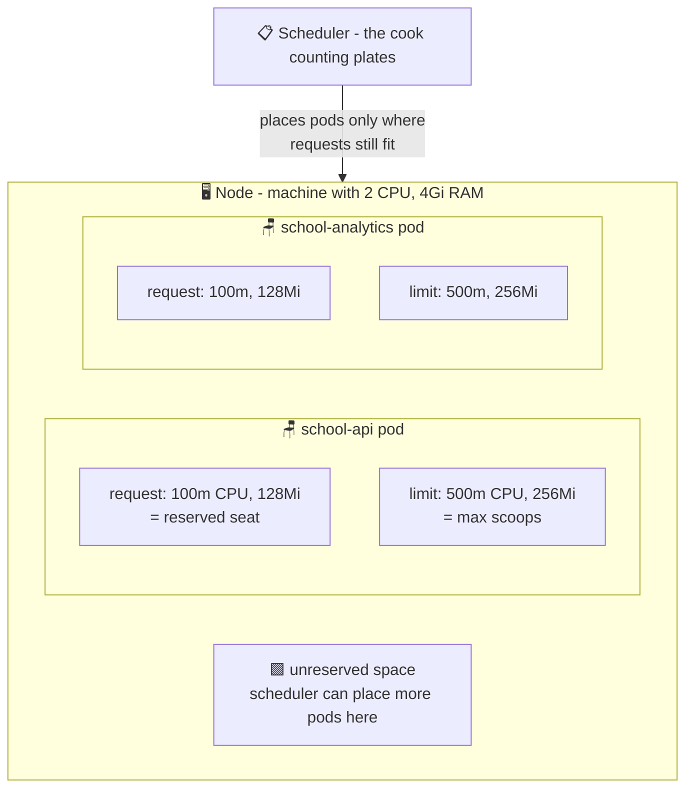

# 🍛 Lesson 08 — Requests & limits: lunch portions

**📍 You are here:** Lesson **08** of 13 · Previous: `lesson-07-health-probes` · Next: `lesson-09-autoscaling`

---

## 📦 What's in this branch

Lessons 01–07, **plus**: **resource requests and limits** — how CPU and memory
are shared fairly, and how Kubernetes decides *which machine* a pod lands on.
Real file:

- [k8s/deployment.yaml](../../k8s/deployment.yaml) — the `resources:` block

## 🧒 Explain like I'm 5

School canteen 🍛. Two rules keep lunchtime fair:

1. **The promised plate** — every kid is *guaranteed* one plate of food. The
   cook counts plates before letting kids in: 30 plates, 30 kids, door closed.
   Nobody enters a canteen that can't feed them.
   → That's the **request**: a *reservation*. Kubernetes only places a pod on
   a machine that still has that much CPU/RAM spare.

2. **The seconds cap** — a hungry kid may take seconds, but *at most 2 extra
   scoops*. No kid may empty the whole pot while others starve.
   → That's the **limit**: a *hard cap* on what the pod may actually use.

Different foods behave differently when you hit the cap, though:
- **CPU** is like soup 🍲 — if you hit the cap, you're just served *slower*
  (throttled). Annoying, not deadly.
- **Memory** is like your stomach 🫃 — there is no "eating slower". If a pod
  tries to use more memory than its limit, it's **killed** on the spot
  (the famous **OOMKilled**).

## 🗺️ Diagram



## ❓ What

- **`requests`** — what the pod is guaranteed. Used by the **scheduler** to
  pick a node ("does this machine still have 100m CPU + 128Mi unreserved?").
- **`limits`** — what the pod may never exceed. CPU over limit → throttled;
  memory over limit → container **OOMKilled** and restarted.
- Units: `100m` = 100 millicores = 0.1 CPU core. `128Mi` = 128 mebibytes.
- These numbers are also the **HPA's yardstick** (lesson 09): "70% CPU" means
  70% *of the request*, i.e. 70m of our 100m.

## 🤔 Why

Without requests, the scheduler is packing a canteen **blindfolded** — 50 kids
in a 30-plate room, and everyone's lunch is ruined (nodes overload, random pods
die). Without limits, one leaky app eats a whole machine and takes its innocent
neighbors down with it. Requests + limits = fair sharing + predictable
placement + a blast radius of exactly one pod. Every production cluster review
starts with "do your pods have resources set?".

## 🔧 How (in this repo)

In [k8s/deployment.yaml](../../k8s/deployment.yaml) (same in the analytics one):

```yaml
resources:
  requests:
    cpu: 100m        # reserve 0.1 core  → scheduler's math
    memory: 128Mi    # reserve 128Mi
  limits:
    cpu: 500m        # may burst to half a core, then throttled
    memory: 256Mi    # touch 257Mi → OOMKilled 💀
```

With `replicas: 2`, this app reserves 200m CPU + 256Mi total — the scheduler
does this arithmetic for every pod on every node, all day long.

## 🧪 Try it

```bash
# What did the scheduler reserve on your node?
kubectl describe node | grep -A8 "Allocated resources"

# Live usage vs those numbers (needs metrics-server):
kubectl -n school top pods

# See an OOMKill with your own eyes (safe — it's just one test pod):
kubectl -n school run greedy --restart=Never --image=polinux/stress \
  --overrides='{"spec":{"containers":[{"name":"greedy","image":"polinux/stress",
    "resources":{"limits":{"memory":"50Mi"}},
    "args":["--vm","1","--vm-bytes","200M","--vm-hang","0"],"command":["stress"]}]}}'
kubectl -n school get pod greedy -w        # → OOMKilled 💀 (Ctrl+C, then clean up:)
kubectl -n school delete pod greedy
```

## ⏭️ Next

Requests are the yardstick for the coolest trick yet: pods that **multiply on
busy days** all by themselves — the HorizontalPodAutoscaler.

```bash
git checkout lesson-09-autoscaling
```
