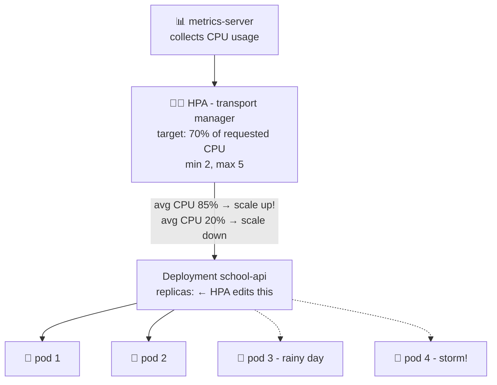

# 🚌 Lesson 09 — Autoscaling: extra buses on rainy days

**📍 You are here:** Lesson **09** of 13 · Previous: `lesson-08-resources` · Next: `lesson-10-ingress`

---

## 📦 What's in this branch

Lessons 01–08, **plus**: the **HorizontalPodAutoscaler (HPA)** — pods that
multiply under load and shrink back when it's quiet. Real file:

- [k8s/hpa.yaml](../../k8s/hpa.yaml) — scales `school-api` between 2 and 5 pods at 70% CPU

## 🧒 Explain like I'm 5

On sunny days, 2 school buses 🚌🚌 are plenty — some kids walk, some cycle.
But on a **rainy day**, EVERYONE wants the bus! Kids squeeze in, bags on laps,
someone's sitting on the steps… 🌧️😫

A smart transport manager watches how full the buses are:

- **More than 70% full?** → roll out another bus. Still crowded? Another one —
  up to the **5 buses** the school owns.
- **Sun's back, buses half empty?** → park the extras. But **never fewer than
  2** — even on the emptiest day, kids must be able to ride (and one bus might
  break down — remember lesson 03!).

The **HPA** is that manager: it watches your pods' CPU every 15 seconds and
adds or removes *pods* (not bigger pods — MORE pods; that's the "horizontal").

## 🗺️ Diagram



## ❓ What

- The **HPA** watches a metric (here: average CPU across the pods, as a % of
  each pod's **request** from lesson 08 — 70% of 100m = 70m) and adjusts
  `replicas` on the Deployment between `minReplicas: 2` and `maxReplicas: 5`.
- It needs the **metrics-server** add-on installed — no measurements, no manager.
- Scale-up is fast (crowded buses are urgent); scale-down is deliberately slow
  and stabilized (don't park a bus the second the rain pauses).
- Horizontal (more pods) vs vertical (bigger pods) — web apps almost always
  scale horizontally: many small identical buses beat one giant bus.

## 🤔 Why

Fixed capacity is always wrong: pay for 5 pods at 3 AM (waste 💸) or run 2 pods
during the exam-results rush (crash 😱). The HPA rides the actual load curve.
And notice the beautiful stack you've built: HPA changes a *number* → the
Deployment (lesson 03) makes desks → the Service (lesson 04) instantly includes
them → probes (lesson 07) gate their traffic. Every lesson is a gear in this
machine.

## 🔧 How (in this repo)

[k8s/hpa.yaml](../../k8s/hpa.yaml):

```yaml
scaleTargetRef:
  kind: Deployment
  name: school-api        # whose bus fleet to manage
minReplicas: 2            # never fewer (availability floor)
maxReplicas: 5            # never more (budget ceiling)
metrics:
  - type: Resource
    resource:
      name: cpu
      target:
        type: Utilization
        averageUtilization: 70    # % of each pod's REQUESTED cpu
```

## 🧪 Try it

```bash
# minikube: enable metrics first:  minikube addons enable metrics-server
kubectl apply -f k8s/hpa.yaml
kubectl -n school get hpa -w          # TARGETS shows live %, e.g. 12%/70%

# Rainy day generator 🌧️ — hammer the API from a loop pod:
kubectl -n school run rain --rm -it --image=busybox --restart=Never \
  -- /bin/sh -c 'while true; do wget -qO- http://school-api >/dev/null; done'

# In another terminal, watch buses roll out (takes ~1–2 min):
kubectl -n school get hpa,pods -w

# Ctrl+C the rain pod, then watch it calmly scale back to 2 (~5 min).
```

## ⏭️ Next

Everything so far is *inside* the school. How does the outside world — parents,
browsers, the internet — get in? Through the **main gate**: Ingress.

```bash
git checkout lesson-10-ingress
```
