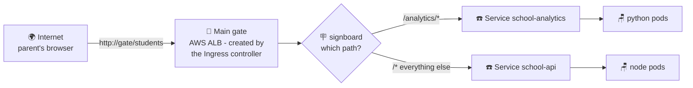

# 🏫 Lesson 10 — Ingress: the main gate and its signboard

**📍 You are here:** Lesson **10** of 13 · Previous: `lesson-09-autoscaling` · Next: `lesson-11-rollouts`

---

## 📦 What's in this branch

Lessons 01–09, **plus**: the **Ingress** — HTTP traffic from the internet into
the right Service. Real file:

- [k8s/ingress.yaml](../../k8s/ingress.yaml) — one AWS load balancer, two paths, two services

## 🧒 Explain like I'm 5

A school has ONE **main gate** 🏫 — not a separate gate for every classroom
(imagine paying a guard for 30 gates! 💸). At the gate stands a guard with a
**signboard**:

> 🪧 "Here for **sports day**? → go LEFT to the playground.
> Everything else? → go STRAIGHT to the office."

Visitors just walk to the one gate; the guard reads *where they want to go* and
points them to the right room.

The **Ingress** is that gate + signboard:

- ONE public entrance (on AWS: one Application Load Balancer) for the whole app.
- Rules based on the URL: `/analytics/...` → the Python service,
  everything else (`/`) → the Node service.
- The gate itself is built by a **guard company** — the *ingress controller*
  (on EKS: the AWS Load Balancer Controller add-on). No guard company hired =
  signboard exists but no one reads it!

## 🗺️ Diagram



## ❓ What

- An **Ingress** is a set of HTTP routing rules: host/path → Service. It's just
  data; an **ingress controller** watches these rules and configures a real
  load balancer to enforce them.
- Ours uses `ingressClassName: alb` + annotations, so the AWS controller
  builds an **internet-facing ALB** that routes straight to pod IPs and
  health-checks them on `/healthz` (lesson 07's endpoint, reused!).
- Rule order matters: `/analytics` (specific) is listed before `/` (catch-all).
- Locally there's no AWS — minikube uses an NGINX ingress controller instead;
  same Ingress idea, different guard company.

## 🤔 Why

Lesson 04's Services are `ClusterIP` — internal only, on purpose. You *could*
expose each service with its own cloud `LoadBalancer`, but every LB costs real
money and you'd manage TLS, domains and routing N times. One Ingress = **one
gate, one bill, one place** for HTTPS certificates and path rules — and adding
a third service someday is just one more line on the signboard.

## 🔧 How (in this repo)

[k8s/ingress.yaml](../../k8s/ingress.yaml), the interesting bits:

```yaml
metadata:
  annotations:
    alb.ingress.kubernetes.io/scheme: internet-facing   # public gate
    alb.ingress.kubernetes.io/target-type: ip           # straight to pod IPs
    alb.ingress.kubernetes.io/healthcheck-path: /healthz
spec:
  ingressClassName: alb
  rules:
    - http:
        paths:
          - path: /analytics    # specific first!
            backend: { service: { name: school-analytics, port: { number: 80 } } }
          - path: /             # catch-all last
            backend: { service: { name: school-api, port: { number: 80 } } }
```

## 🧪 Try it

```bash
# LOCAL (minikube):
minikube addons enable ingress                # hire the local guard company
# use a local-friendly ingress (no ALB annotations needed):
sed '/alb.ingress/d; s/ingressClassName: alb/ingressClassName: nginx/' \
  k8s/ingress.yaml | kubectl apply -f -
kubectl -n school get ingress                 # note the ADDRESS
minikube tunnel                               # then browse http://127.0.0.1/

# ON EKS (after terraform apply + installing the AWS LB Controller):
kubectl apply -f k8s/ingress.yaml
kubectl -n school get ingress -w              # ADDRESS becomes a real ALB DNS name
curl http://<ALB-address>/students            # → Node API
curl http://<ALB-address>/analytics/summary   # → Python API
```

## ⏭️ Next

Traffic flows! Now: how do you ship **version 2** without a second of downtime —
and how do you *undo* a bad release? **Rollouts & rollbacks.**

```bash
git checkout lesson-11-rollouts
```
