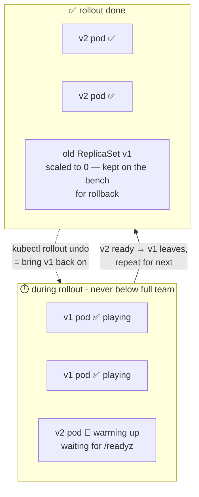

# ⚽ Lesson 11 — Rollouts & rollbacks: substituting players mid-game

**📍 You are here:** Lesson **11** of 13 · Previous: `lesson-10-ingress` · Next: `lesson-12-storage`

---

## 📦 What's in this branch

Lessons 01–10, **plus**: **rolling updates** and **rollbacks** — shipping new
versions with zero downtime, and the escape hatch when a release is bad.
Real files:

- [k8s/deployment.yaml](../../k8s/deployment.yaml) — the `strategy:` block
- [.circleci/config.yml](../../.circleci/config.yml) — where `kubectl rollout status` gates the pipeline

## 🧒 Explain like I'm 5

A football match ⚽. Your team of 2 players is on the field and you want to
bring in fresh players — but the game **never stops**. So the coach substitutes
**one at a time**:

1. Fresh player warms up on the sideline 🏃 (new pod starts).
2. Referee checks they're ready — laces tied, warmed up 🙋 (readiness probe,
   lesson 07!).
3. **Only then** does the tired player walk off (old pod terminates).
4. Repeat for the next player.

At every moment, a full team is on the field. The crowd never notices a thing —
that's a **rolling update**.

And if the new player plays terribly? 😬 The coach doesn't panic and doesn't
wait for a new signing — **the old player is still on the bench**. One shout:
"come back on!" — that's a **rollback**. Kubernetes keeps the old team sheet
(ReplicaSet) exactly for this.

## 🗺️ Diagram



## ❓ What

- **`strategy: RollingUpdate`** with two knobs:
  - `maxUnavailable: 0` — never play a player short (never drop below desired
    replicas). Safest setting.
  - `maxSurge: 1` — allowed 1 extra player during the swap (briefly 3 pods).
- Each new image = a **new ReplicaSet**; old ones are kept (scaled to 0) as
  rollback targets — the bench.
- **`kubectl rollout status`** — "did the substitution finish cleanly?" —
  perfect for CI gates. **`kubectl rollout undo`** — instant rollback.
- Readiness probes are the referee: no `/readyz`, no traffic — a broken v2
  never gets the ball, and with `maxUnavailable: 0` the rollout simply stalls
  instead of taking the site down.

## 🤔 Why

Deploying used to mean "maintenance window at midnight" 🌙. Rolling updates
make deploys boring: ship at 2 PM on a Tuesday, users notice nothing. And
because bad releases are a *when*, not an *if*, the bench (rollback) turns a
production fire into a 10-second shrug. This lesson is where lessons 03
(desired state), 07 (readiness) and 04 (services routing only to ready pods)
all click together.

## 🔧 How (in this repo)

[k8s/deployment.yaml](../../k8s/deployment.yaml):

```yaml
strategy:
  type: RollingUpdate
  rollingUpdate:
    maxUnavailable: 0   # full team on the field, always
    maxSurge: 1         # one warming-up player allowed
```

In CI ([.circleci/config.yml](../../.circleci/config.yml)), after `kubectl apply`:
`kubectl rollout status deployment/school-api` — the pipeline goes green only
when the substitution completed.

## 🧪 Try it

```bash
# Ship a "new version" (any image change triggers a rollout):
kubectl -n school set image deployment/school-api school-api=nginxdemos/hello:latest
kubectl -n school rollout status deployment/school-api   # watch the substitutions
kubectl -n school get replicasets                        # old RS at 0 = the bench

# Ship a BROKEN version — and watch Kubernetes protect you:
kubectl -n school set image deployment/school-api school-api=busybox:1.36
kubectl -n school get pods                # new pod crash-loops, old pods still serve!

# The 10-second shrug:
kubectl -n school rollout undo deployment/school-api
kubectl -n school rollout history deployment/school-api  # the team sheet history
```

## ⏭️ Next

Pods are disposable — so what happens to data that must **survive**?
Volumes, PersistentVolumeClaims, and why our database lives outside the
cluster: **storage & state**.

```bash
git checkout lesson-12-storage
```
