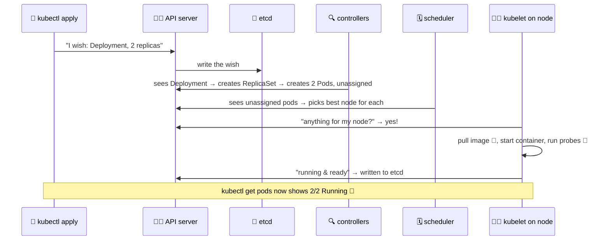

# 🏢 Lesson 13 — Under the hood: the school office

**📍 You are here:** Lesson **13** of 13 — the final lesson! · Previous: `lesson-12-storage`

---

## 📦 What's in this branch

All 13 lessons — this branch is the complete course. The finale: the **control
plane** — the machinery that made every previous lesson actually happen.
Bonus deep-dive with 4K diagrams: [docs/under-the-hood.md](../../docs/under-the-hood.md).

## 🧒 Explain like I'm 5

All this time you've been talking to "the school" — but who actually RUNS it?
Walk into the **school office** 🏢 and meet the staff:

- **The principal** 🧑‍💼 (**API server**) — the ONLY person anyone may talk to.
  Parents (`kubectl`), teachers, even other staff — everything goes through the
  principal's desk. "I want 2 pods" is a letter handed to the principal.
- **The big register** 📖 (**etcd**) — the principal writes EVERYTHING in one
  sacred book: every class, kid, rule, wish. Lose the register = lose the
  school's memory. It IS the school, really.
- **The timetable-maker** 🗓️ (**scheduler**) — sees "new kid, no desk assigned"
  in the register and picks the best classroom (lesson 08's plate-counting!).
  Writes the assignment back in the register. Doesn't place desks personally!
- **The checkers** 🔍 (**controller manager**) — clerks who *forever* compare
  the register's wishes with reality: "register says 2 plant-waterers, I count
  1 → write an order for one more." Lesson 03's class monitor lives here!
- **The class teachers** 🧑‍🏫 (**kubelet**, one per machine) — out in the
  classrooms. Each keeps asking the principal "anything for MY room?" and then
  actually starts the containers, runs lesson 07's probes, reports back.

The magic you've felt all course — self-healing, autoscaling, rollouts — is
just these five, endlessly reading and writing one register. No magic. 🪄❌

## 🗺️ Diagram — what `kubectl apply` really does



## ❓ What

- **Control plane** (the office): API server, etcd, scheduler, controller
  manager. On EKS, **AWS runs all of this for you** — that's what the
  ~$73/month is buying (see [terraform/eks.tf](../../terraform/eks.tf)).
- **Worker nodes** (the classrooms): kubelet + container runtime + kube-proxy
  (the hallway signs that make lesson 04's Service IPs actually route).
- The universal pattern: **everything is a wish written to etcd, and
  controllers reconcile reality toward it, forever.** Deployment, HPA, Ingress,
  PVC — every lesson was this one pattern wearing different costumes.

## 🤔 Why

Why should you care about the office staff? Because now every behavior you've
seen has a *mechanical* explanation — and debugging becomes deduction, not
guessing:

- Pod stuck `Pending`? → the **timetable-maker** can't find a room
  (usually lesson 08's requests don't fit any node).
- Pod `CrashLoopBackOff`? → the **class teacher** starts it, it dies, repeat
  (check `kubectl logs`; often lesson 06's config is wrong).
- `kubectl` hangs? → the **principal's desk** is unreachable (kubeconfig, VPN,
  cluster down).
- Changes ignored? → some **checker** is reconciling against you — remember
  the HPA editing your replica count in lesson 09?

## 🔧 How (in this repo)

- [terraform/eks.tf](../../terraform/eks.tf) — one Terraform resource asks AWS
  for a complete managed office + a node group of classroom machines.
- [.circleci/config.yml](../../.circleci/config.yml) — CI is "just another
  parent": `aws eks update-kubeconfig` gets credentials to speak to the
  principal, then `kubectl apply` hands over the letters (manifests) you've
  studied for 12 lessons.
- [docs/under-the-hood.md](../../docs/under-the-hood.md) — the same story in
  three 4K diagrams: `docker run`, `kubectl apply`, and the life of one HTTP
  request through ALB → Service → pod.

## 🧪 Try it

```bash
kubectl get nodes -o wide                      # the classroom machines
kubectl -n kube-system get pods                # office staff & helpers you can see
kubectl get --raw /healthz && echo             # ask the principal directly: "ok"

# Watch the office gossip live while you break something (lesson 03 chaos):
kubectl -n school get events -w
# in another terminal:  kubectl -n school delete pod -l app=school-api --wait=false
# → watch: killing → SuccessfulCreate → Scheduled → Pulled → Started. The whole office, on record.
```

## 🎓 You made it!

You now know: containers → pods → deployments → services → namespaces →
config & secrets → probes → resources → autoscaling → ingress → rollouts →
storage → the control plane. That's not "beginner Kubernetes" — that's the
**working vocabulary of a platform engineer**.

Where to go next, using this very repo:

1. **Run it all locally**: `docker compose up`, then minikube + the manifests.
2. **Go to the real cloud**: [terraform/](../../terraform/) → `terraform apply`
   → deploy via [.circleci/config.yml](../../.circleci/config.yml)
   (⚠️ costs real money — `terraform destroy` the same day!).
3. **Read the production design doc**: [docs/architecture.html](../../docs/architecture.html)
   — multi-tenancy for 100 schools, built on everything you just learned.

```bash
git checkout main   # back to the beginning — but you're not the same 🧑‍🎓
```
