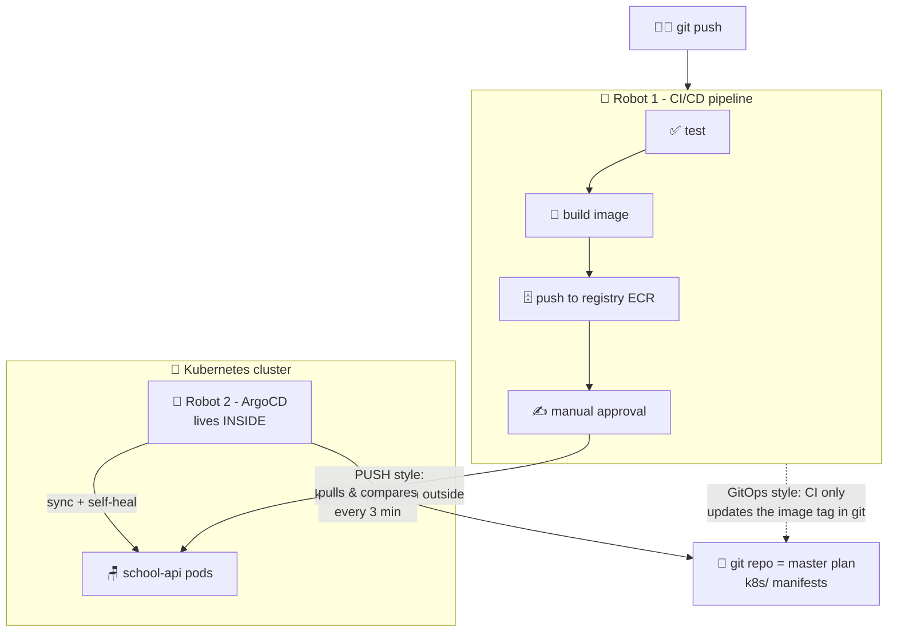

# 🤖 Lesson 14 (bonus) — Deploy: CI/CD & GitOps with ArgoCD

**📍 You are here:** Bonus lesson **14** · Previous: `lesson-13-under-the-hood` · Next bonus: `lesson-15-multi-az-scaling`

---

## 📦 What's in this branch

All 13 core lessons, **plus** the finale: how code actually reaches the cluster
**without a human typing kubectl** — two robot styles: **CI/CD (push)** and
**GitOps with ArgoCD (pull)**. Real files:

- [.circleci/config.yml](../../.circleci/config.yml) — the full push-style pipeline this repo ships with
- [argocd-app.yaml](argocd-app.yaml) — a ready-to-apply ArgoCD Application for the pull style

## 🧒 Explain like I'm 5

**Robot #1 — the homework robot (CI/CD, push style).** 📮
You drop your homework in the school letterbox (`git push`). A robot picks it up:

1. **Checks it** — spelling, math, everything (runs the tests). Bad homework
   never goes further.
2. **Photocopies it** — makes the official copy (builds the Docker image 🍱).
3. **Files the copy** in the school cabinet (pushes to the ECR registry).
4. **Waits for the headteacher's signature** ✍️ (the manual approval gate).
5. **Delivers it** to every classroom itself (`kubectl apply` into the cluster).

The robot *pushes* its way into the school with a master key (AWS credentials
stored in CI). Fast and simple — but the key lives *outside* the school. 🔑😬

**Robot #2 — the caretaker robot (GitOps, pull style).** 🤖
This robot **lives inside the school** and holds no outside key. On the wall
hangs the **master plan book** (your git repo — the k8s/ folder). Every few
minutes the caretaker:

- reads the book 📖,
- walks the halls comparing plan vs reality,
- **fixes any difference** — new page in the book? Rebuild the room. A kid
  moved the chairs around by hand? Put them back *exactly as the book says*.

Want to deploy? **You don't touch the school at all — you edit the book.**
Want to roll back? Flip to yesterday's page (`git revert`). Want to know what's
running? Read the book — it's *always* the truth.

## 🗺️ Diagram



## ❓ What

- **CI (Continuous Integration)** — every push is automatically tested and
  built. **CD (Continuous Delivery/Deployment)** — the built thing is
  automatically released. Our CircleCI pipeline is both.
- **GitOps** — the deployment philosophy where **git is the single source of
  truth**: the cluster continuously converges to what's committed. Nobody runs
  kubectl by hand; changes = pull requests. ArgoCD and Flux are the two big
  tools; ArgoCD adds a great UI.
- **The key difference**: push = CI holds cluster credentials and shoves
  changes in. Pull = an in-cluster agent fetches from git; cluster credentials
  never leave the cluster.
- Recognize the pattern? ArgoCD is **lesson 03's class monitor, but for the
  whole cluster, with git as the desired state**. Same reconcile loop, one
  level up. Even drift-fixing (self-heal) is exactly the monitor sending the
  extra kid back.

## 🤔 Why

Hand-run `kubectl apply` works... until Friday 6 PM: *what's deployed? who
changed it? why is prod different from the YAML?* Nobody knows. 🔥

- **CI/CD** kills "works on my machine" and "forgot to run tests" — every
  deploy is tested, tagged with a commit SHA, and traceable.
- **GitOps** kills *configuration drift* — the silent gap between your YAML
  files and reality. With self-heal on, drift survives ~3 minutes, then the
  caretaker fixes it. Your git log becomes your deploy log — audit for free.
- Real teams typically use **both**: CI tests & builds the image, then commits
  the new image tag *into the manifest repo* — and ArgoCD does all the actual
  deploying. The pipeline never touches the cluster.

## 🔧 How (in this repo)

**Push style — already wired:** [.circleci/config.yml](../../.circleci/config.yml)
runs `test-node` + `test-python` in parallel → `build-and-push` (both images →
ECR, tagged with the git SHA) → `hold-for-approval` → `deploy-to-eks`
(`kubectl apply` + `rollout status`, lesson 11's gate). Note the least-privilege
detail: test jobs get **no** AWS credentials; only the AWS-touching jobs
receive the shared credentials context.

**Pull style — this lesson adds it:** [argocd-app.yaml](argocd-app.yaml) tells
ArgoCD: *"watch the `k8s/` folder of this repo's `main` branch, keep namespace
`school` matching it, prune deleted things, and self-heal drift."*

```yaml
spec:
  source:
    repoURL: https://github.com/BaluRaut/learn-kubernetes-school.git
    targetRevision: main
    path: k8s                    # 📖 the master plan pages
  syncPolicy:
    automated:
      prune: true                # deleted from git → deleted from cluster
      selfHeal: true             # hand-edits get reverted. The book wins.
```

## 🧪 Try it (all local, ~15 min)

```bash
# 1) Install the caretaker robot into your local cluster:
kubectl create namespace argocd
kubectl apply -n argocd -f https://raw.githubusercontent.com/argoproj/argo-cd/stable/manifests/install.yaml

# 2) Open its UI:
kubectl -n argocd port-forward svc/argocd-server 8080:443 &
kubectl -n argocd get secret argocd-initial-admin-secret \
  -o jsonpath='{.data.password}' | base64 -d; echo   # login: admin + this password
# browse https://localhost:8080

# 3) Fork this repo on GitHub, then edit argocd-app.yaml's repoURL to YOUR fork,
#    and in k8s/deployment.yaml replace IMAGE_PLACEHOLDER with a real image
#    (e.g. nginxdemos/hello:plain-text) — commit & push to your fork.

# 4) Hand ArgoCD the plan book:
kubectl apply -f lessons/14-deploy-gitops/argocd-app.yaml
# watch the UI: it clones your repo, shows a diff, and syncs the school into being 🎉

# 5) Feel GitOps — deploy WITHOUT kubectl:
#    edit k8s/deployment.yaml in your fork: replicas: 2 → 3, push...
#    ...and watch a third pod appear on its own within ~3 minutes.

# 6) Feel self-heal — try to cause drift by hand:
kubectl -n school scale deployment school-api --replicas=5
kubectl -n school get pods -w    # the caretaker puts it back to 3. The book wins. 🤖
```

## 🎓 The end — for real this time

Push pipelines, pull reconcilers, and everything from lunchboxes to the control
plane in between. You now understand not just *what* runs your app, but *what
deploys it and keeps it honest*. One last bonus: making it survive a building
fire and exam-results day.

```bash
git checkout lesson-15-multi-az-scaling   # multi-AZ + the scaling ladder 🏫🏫
```
