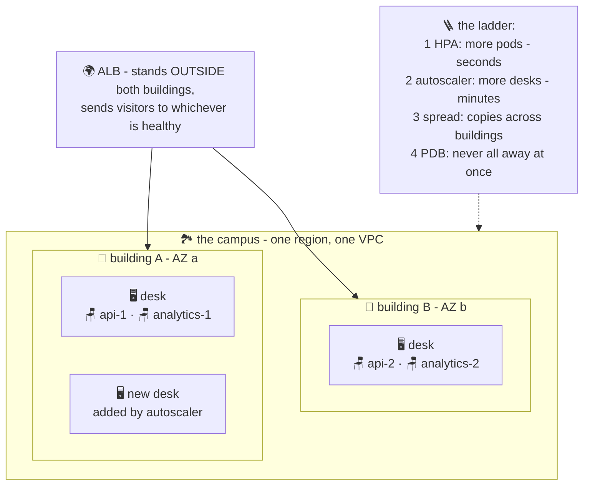

# 🏫🏫 Lesson 15 (bonus) — Multi-AZ & the scaling ladder

**📍 You are here:** Bonus lesson **15** — the resilience lesson · Previous: `lesson-14-deploy-gitops`

---

## 📦 What's in this branch

All previous lessons, **plus** the two questions every real cluster must
answer: *what if a whole building burns down?* (**multi-AZ**) and *what
happens on exam-results day?* (**the scaling ladder**). Real files:

- [terraform/vpc.tf](../../terraform/vpc.tf) — subnets created in **multiple AZs** (this was the plan all along!)
- [terraform/eks.tf](../../terraform/eks.tf) — the node group **spans** those subnets
- [k8s/hpa.yaml](../../k8s/hpa.yaml) — rung 1 of the ladder (lesson 09)

## 🧒 Explain like I'm 5

**The fire problem.** 🏫🔥 A school that puts every kid in ONE building has
one fire away from no school at all. Real schools use a **campus**: buildings
A and B (**availability zones** — separate power, separate everything), and
one rule: *"never seat the whole class in one building."* Building A burns?
Sad day, but classes continue in B. That's **multi-AZ**.

**The exam-day problem.** 📝 On results day, a thousand parents arrive at
once. The school climbs a **ladder**, cheapest rung first:

1. **More helpers per room** 🙋 (HPA, lesson 09): the transport manager adds
   pods — seconds, free, but only works while desks have space.
2. **More desks** 🖥️ (the **cluster autoscaler**): pods are standing with
   nowhere to sit (`Pending`!) → it asks the ASG for more EC2 desks —
   takes a minute or two, costs money, solves the real limit.
3. **Spread the twins** 👯 (**topology spread**): don't put all
   `school-api` copies in one building — 2 replicas = 2 buildings. The fire
   rule and the scaling story meet here.
4. **Never everyone at lunch at once** 🍽️ (**PodDisruptionBudget**): during
   desk-shuffling (upgrades, scale-down), at least N helpers must stay on
   duty. Voluntary moves wait; the class is never unattended.

## 🗺️ Diagram



## ❓ What

- **AZ** = physically separate data center in a region (AWS course,
  lesson 07). The **EKS control plane is multi-AZ automatically** — AWS runs
  the office across buildings; you only design the desks' side.
- **Multi-AZ nodes**: give the node group subnets in ≥2 AZs
  ([vpc.tf](../../terraform/vpc.tf) + [eks.tf](../../terraform/eks.tf) do) —
  the ASG then spreads and replaces desks across buildings.
- **Cluster autoscaler** (or its newer cousin **Karpenter**): watches for
  `Pending` pods → grows the ASG; shrinks it when desks idle. HPA moves
  *pods*, autoscaler moves *desks* — a duet, not rivals.
- **topologySpreadConstraints** — add to a Deployment's pod spec:

```yaml
topologySpreadConstraints:
  - maxSkew: 1                                  # buildings may differ by ≤1 copy
    topologyKey: topology.kubernetes.io/zone    # spread BY BUILDING
    whenUnsatisfiable: ScheduleAnyway           # prefer, don't deadlock
    labelSelector: { matchLabels: { app: school-api } }
```

- **PodDisruptionBudget** — `minAvailable: 1` for a 2-replica app: node
  drains and upgrades proceed one desk at a time, never emptying the class.
- Don't forget the data: pods spread easily; **EBS drawers are per-building**
  (a volume lives in ONE AZ!) — one more reason this repo keeps state in
  RDS, which has its own `multi_az` switch.

## 🤔 Why

An AZ outage is a *when*, not an *if* — and it's survivable **only** if
replicas, nodes AND traffic already span buildings before the fire. Scaling
without multi-AZ is a fast single point of failure; multi-AZ without
autoscaling is resilience that falls over at the first exam day. The ladder
is the whole point of everything you've learned: lesson 03's monitor,
lesson 09's buses, the AWS course's ASG desks — climbing together.

## 🧪 Try it

```bash
# which building is each desk in? (works on EKS; minikube has 1 "building")
kubectl get nodes -L topology.kubernetes.io/zone

# where do the copies sit right now?
kubectl -n school get pods -o wide

# rung 2, felt: ask for more pods than the desks can seat →
kubectl -n school scale deployment school-api --replicas=20
kubectl -n school get pods | grep Pending | head -5
# Pending = kids standing without desks — EXACTLY what the cluster
# autoscaler watches for. (On EKS with it installed: new nodes in ~2 min.)
kubectl -n school scale deployment school-api --replicas=2   # calm down

# rung 4: protect the class during desk-shuffles:
kubectl -n school create pdb school-api --selector=app=school-api --min-available=1
kubectl -n school get pdb    # ALLOWED DISRUPTIONS: 1 — never both at once 🎉
```

## 🎓 The campus is complete

Self-healing pods (03), rainy-day buses (09), zero-downtime substitutions
(11), robots that deploy (14) — and now a school that survives fires and
results day. That's not a demo cluster anymore; that's an architecture. 🏫🏫

```bash
git checkout main
```
