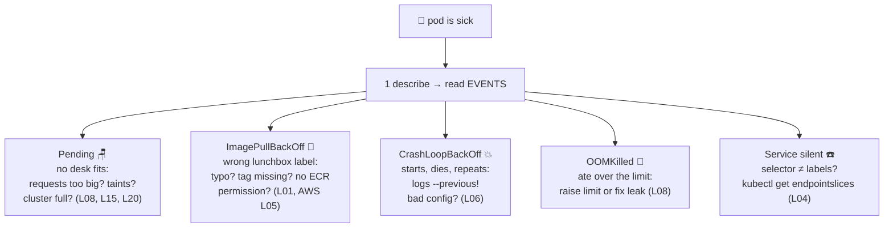

# 🩺 Lesson 16 — The debugging playbook: the nurse's triage chart

**📍 You are here:** Lesson **16** of 26 — Part 3 begins: running it for real · Previous: `lesson-15-multi-az-scaling` · Next: `lesson-17-rbac`

---

## 📦 What's in this branch

Everything before, **plus** the lesson you'll use weekly forever: the
**triage chart** for every classic pod sickness, and the five-tool drill
that diagnoses all of them.

## 🧒 Explain like I'm 5

The school nurse 🩺 doesn't panic and doesn't guess. Whatever walks in, she
runs the same drill: **look at the chart, ask the standard questions, then
treat.** Kubernetes debugging is exactly that. The five questions, in order:

1. `kubectl describe pod X` — the patient's chart: **Events at the bottom
   are 90% of every diagnosis.** Read them first, always.
2. `kubectl logs X` — what the patient said before fainting.
   `--previous` = what they said before the *last* faint (crucial for
   crash loops!). `-f` = listen live.
3. `kubectl get events -w` — the hallway gossip: everything happening in
   the room, in order.
4. `kubectl exec -it X -- sh` — examine the patient from inside.
5. `kubectl port-forward X 8080:3000` — call the patient directly,
   skipping reception (bypasses Service/Ingress to isolate WHERE it breaks).

## 🗺️ Diagram



## ❓ What (the chart, symptom by symptom)

| Symptom | Meaning | First question |
|---|---|---|
| `Pending` | scheduler found no desk | `describe`: which condition failed — resources, taints, volume zone? |
| `ImagePullBackOff` | can't fetch the lunchbox | exact image string? tag exists? registry auth (node's IAM hat)? |
| `CrashLoopBackOff` | starts then dies, repeatedly | `logs --previous`; then env/config, then command |
| `OOMKilled` (exit 137) | memory limit hit | `describe` shows Last State; raise limit or find the leak |
| `Running` but not `Ready` | readiness probe failing | is `/readyz` actually healthy? DB reachable? (L07) |
| Service returns nothing | selector/labels mismatch | `get endpointslices` — empty list = reception has nobody |
| Node `NotReady` | the desk itself is sick | it's an EC2 story: `describe node`, then AWS course L12 |

## 🤔 Why

Every earlier lesson taught a *mechanism*; incidents are those mechanisms
failing one at a time. The pros aren't smarter — they just always run the
same drill instead of guessing. Events → logs → exec. In that order.

## 🧪 Try it — infirmary drill (safe, self-inflicted)

```bash
# patient 1: ImagePullBackOff
kubectl -n school run sick1 --image=nginxdemos/hello:no-such-tag
kubectl -n school describe pod sick1 | tail -5        # Events tell you instantly

# patient 2: CrashLoopBackOff
kubectl -n school run sick2 --image=busybox -- sh -c "echo I die now; exit 1"
kubectl -n school logs sick2 --previous 2>/dev/null || kubectl -n school logs sick2

# patient 3: Pending (impossible request)
kubectl -n school run sick3 --image=nginx --overrides='{"spec":{"containers":[{"name":"sick3","image":"nginx","resources":{"requests":{"cpu":"100"}}}]}}'
kubectl -n school describe pod sick3 | grep -A3 Events

# discharge everyone:
kubectl -n school delete pod sick1 sick2 sick3
```

## ⏭️ Next

Who is even ALLOWED to run these commands — and why your CI robot
shouldn't be cluster-admin: **RBAC**.

```bash
git checkout lesson-17-rbac
```
