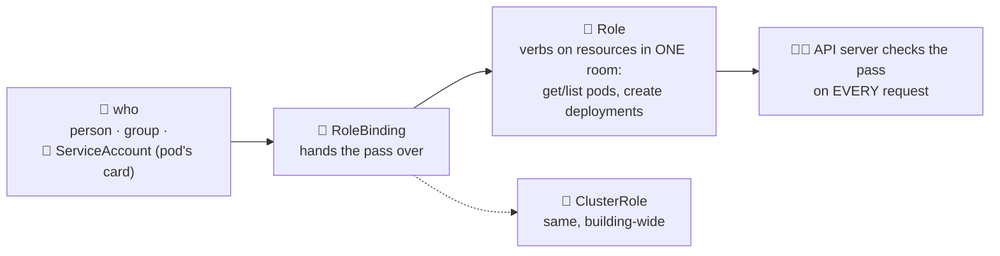

# 🪪 Lesson 17 — RBAC & ServiceAccounts: hall passes

**📍 You are here:** Lesson **17** of 26 · Previous: `lesson-16-debugging` · Next: `lesson-18-jobs-cronjobs`

---

## 📦 What's in this branch

Everything before, **plus**: who may do what *inside* the cluster —
**RBAC** — and identity cards for pods: **ServiceAccounts**.

## 🧒 Explain like I'm 5

The AWS course gave people ID cards for the *cloud* (IAM). But inside the
school building there's a second system: **hall passes** 🪪.

- A **Role** is a pass for ONE room: *"may look at pods in `school`"*.
- A **ClusterRole** is a pass for the whole building: *"may look at pods
  everywhere"* (some doors, like nodes, only exist building-wide).
- A **RoleBinding** hands the pass to someone: a person, a group — or a
  **ServiceAccount**: the ID card a *pod* wears. Every pod wears one
  (`default` unless told otherwise), and robots like ArgoCD do everything
  with theirs.

Same iron rules as IAM: nothing is allowed until a pass says so, and the
pass should open exactly the doors the job needs. Your CI robot needs
"apply manifests in `school`" — **not** cluster-admin. Cluster-admin CI is
the photocopied master key all over again. 🗝️😱

(And the bridge between worlds: on EKS, a ServiceAccount can be linked to
an **IAM role** — IRSA — so a *pod* can wear an *AWS hat*. Hall pass
inside, bank badge outside, zero keys anywhere.)

## 🗺️ Diagram



## ❓ What

- Rules = **verbs** (`get list watch create update delete`) on
  **resources** (`pods`, `deployments`, `secrets`…), optionally specific
  names. No deny rules — RBAC is allow-only (unlike IAM).
- Ready-made ClusterRoles: `view` (read, no secrets), `edit` (most
  writes), `admin` (room master), `cluster-admin` (the master key).
  Bind these before writing custom ones.
- **ServiceAccount** per workload that talks to the API — most app pods
  (like ours) never do, and should keep the powerless default. Set
  `automountServiceAccountToken: false` when unused (hygiene!).
- The magic question: `kubectl auth can-i create deployments -n school`
  — and `--as=system:serviceaccount:school:ci-bot` to test someone else's
  pass without borrowing it.

## 🤔 Why

The cluster's API is root over everything it runs. RBAC is the difference
between "the intern's leaked kubeconfig can read one namespace" and "the
intern's leaked kubeconfig IS the cluster". It's also how teams share a
cluster without fear (namespaces from L05 + RBAC = real multi-tenancy).

## 🧪 Try it

```bash
# what can YOU do? (local clusters: everything — you're cluster-admin)
kubectl auth can-i delete namespaces && kubectl auth can-i list pods -n school

# make a robot card + a one-room pass + hand it over:
kubectl -n school create serviceaccount report-bot
kubectl -n school create role pod-reader --verb=get,list --resource=pods
kubectl -n school create rolebinding report-bot-reads \
  --role=pod-reader --serviceaccount=school:report-bot

# test the pass WITHOUT wearing it:
kubectl auth can-i list pods -n school --as=system:serviceaccount:school:report-bot   # yes
kubectl auth can-i delete pods -n school --as=system:serviceaccount:school:report-bot # no 🎉
kubectl auth can-i list secrets -n school --as=system:serviceaccount:school:report-bot # no!

# cleanup:
kubectl -n school delete rolebinding report-bot-reads
kubectl -n school delete role pod-reader && kubectl -n school delete sa report-bot
```

## ⏭️ Next

Work that runs once and work that runs on a schedule — including the
backup CronJob this repo has been promising since its README: **Jobs &
CronJobs**.

```bash
git checkout lesson-18-jobs-cronjobs
```
