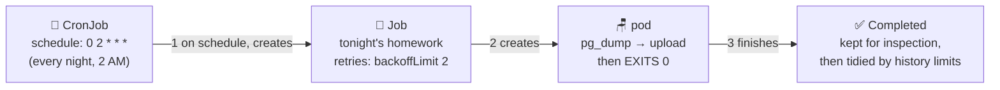

# ⏰ Lesson 18 — Jobs & CronJobs: homework and the morning bell

**📍 You are here:** Lesson **18** of 26 · Previous: `lesson-17-rbac` · Next: `lesson-19-network-policies`

---

## 📦 What's in this branch

Everything before, **plus** work that isn't a server: run-once **Jobs**,
scheduled **CronJobs** — and a real deliverable:

- [k8s/backup-cronjob.yaml](../../k8s/backup-cronjob.yaml) — **the nightly
  `pg_dump` backup the main README promised, finally real** (ships
  `suspend: true` so applying it is safe until you want it)

## 🧒 Explain like I'm 5

Everything so far was kids who **stand at their post all day** (servers:
Deployments keep them there forever). But schools have two other kinds of
work:

- **Homework** 📝 (**Job**): do the task, hand it in, DONE. If the kid
  messes up, they retry (a few times, then the teacher gives up). Nobody
  "restarts" finished homework — that's the whole point. Migrations,
  one-off imports, batch crunching.
- **The morning bell** 🔔 (**CronJob**): *every day at 2 AM, ring the bell
  and hand out that day's homework.* A CronJob doesn't run anything
  itself — on schedule, it **creates a Job**, which creates a pod, which
  does the work and finishes. Backups, reports, cleanups.

Our bell: every night, a pod is born, runs `pg_dump` against the database,
ships the file to the archive, and dies. Beautiful, boring, exactly what
lesson 12's "per-school backups" story needed.

## 🗺️ Diagram



## ❓ What

- **Job** knobs: `backoffLimit` (retries before giving up),
  `completions`/`parallelism` (N pieces of homework, M kids at once),
  `activeDeadlineSeconds` (pencils down!), and pods use
  `restartPolicy: Never/OnFailure` — never `Always` (homework must be
  allowed to END; that's what makes it not-a-server).
- **CronJob** knobs: `schedule` (cron syntax — `0 2 * * *` = 02:00 daily),
  `concurrencyPolicy: Forbid` (don't start tonight's if yesterday's still
  runs!), `startingDeadlineSeconds`, `successfulJobsHistoryLimit` /
  `failedJobsHistoryLimit` (the janitor 🧹), `suspend: true` (the bell's
  off-switch — our default, so you can apply safely).
- Timezone: `timeZone: "Asia/Kolkata"` — else it's the cluster's clock.
- Debugging is lesson 16 verbatim: `kubectl get jobs`, then the pod's
  logs; a failed Job leaves its pods for autopsy.

## 🤔 Why

Without CronJobs, scheduled work lives in some VM's crontab nobody
remembers (drift! lesson 02 of the ArgoCD course says hi) — or worse,
inside the app on one pod ("which replica runs the cleanup?" — with 2
replicas, both do, twice 😱). As a manifest, the backup is versioned,
reviewed, self-healing, and visible to everyone — GitOps-able like
everything else.

## 🧪 Try it

```bash
# homework: one Job, watch it complete
kubectl -n school create job hello-hw --image=busybox -- sh -c 'echo homework done; sleep 2'
kubectl -n school get jobs,pods | grep hello
kubectl -n school logs job/hello-hw            # "homework done"

# the bell, sped up — every minute, so you can watch:
kubectl -n school create cronjob tick --image=busybox --schedule="*/1 * * * *" \
  -- sh -c 'date; echo the bell rang'
kubectl -n school get jobs -w                  # a new Job appears each minute; Ctrl+C
kubectl -n school delete cronjob tick && kubectl -n school delete job hello-hw

# the REAL one — read it, then apply (safe: suspended):
kubectl apply -f k8s/backup-cronjob.yaml
kubectl -n school get cronjob school-db-backup     # SUSPEND: True
# when you have a real DB: flip suspend to false, or fire one manually:
kubectl -n school create job backup-now --from=cronjob/school-db-backup
```

## ⏭️ Next

Right now every pod can whisper to every other pod — even to the
database. Time for passing-notes rules: **NetworkPolicies**.

```bash
git checkout lesson-19-network-policies
```
