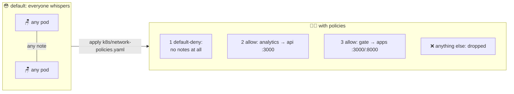

# 🚫📝 Lesson 19 — NetworkPolicies: passing-notes rules

**📍 You are here:** Lesson **19** of 26 · Previous: `lesson-18-jobs-cronjobs` · Next: `lesson-20-taints-affinity`

---

## 📦 What's in this branch

Everything before, **plus** locking down who may talk to whom *inside*
the cluster. Real file:

- [k8s/network-policies.yaml](../../k8s/network-policies.yaml) — default-deny + the two allowances our app actually needs

## 🧒 Explain like I'm 5

Surprise: in a fresh cluster, **every pod can whisper to every pod** 😳 —
any kid can pass a note to any other kid, in any classroom, including
straight to the grade book. One compromised pod = free tour of the whole
school. (Security groups guard the *desks* from outside; nobody's been
watching the notes *inside*.)

**NetworkPolicies** are the passing-notes rules:

1. First rule posted: **"no notes at all in this classroom"**
   (default-deny — an empty-selector policy that selects every pod).
   The moment ANY policy selects a pod, that pod stops accepting
   anything not explicitly allowed.
2. Then, allow exactly the notes the class needs:
   *"analytics may pass notes to school-api, seat 3000 only"* and
   *"the gate (ingress/ALB) may pass notes to both apps"*. Done. A
   compromised pod can now reach… precisely nothing extra.

One honest catch: rules only work if the school hired a teacher who reads
them — the **CNI must support NetworkPolicy**. Minikube: start with
`--cni=calico` (or enable it). EKS: VPC CNI has a network-policy switch
(or install Calico). No enforcer = rules silently ignored — always test!

## 🗺️ Diagram



## ❓ What

- A **NetworkPolicy** selects pods (`podSelector`) and whitelists
  **ingress** (who may talk TO them) and/or **egress** (who they may talk
  to), by pod labels, namespace labels, or CIDR — plus ports.
- Policies are **additive allow-lists**: no deny rules; union of all
  matching policies applies. Unselected pods stay wide open.
- The standard recipe (exactly our file): a default-deny-ingress for the
  namespace, then one small allow per legitimate conversation.
- Don't forget **DNS egress** when you write egress rules (UDP 53) — the
  classic "my policies broke everything" mistake.

## 🤔 Why

Defense in depth: security groups (AWS L10) guard the building, RBAC
(L17) guards the API, NetworkPolicies guard pod-to-pod. It's the
difference between "attacker got one pod" and "attacker got one pod and
then the database". Auditors ask for this by name.

## 🧪 Try it (cluster with a policy-enforcing CNI)

```bash
# before: anyone can reach the api — even a random debug pod:
kubectl -n school run spy --rm -it --image=curlimages/curl --restart=Never \
  -- curl -s -m 3 http://school-api && echo "😳 wide open"

# post the rules:
kubectl apply -f k8s/network-policies.yaml

# the spy is now blocked...
kubectl -n school run spy --rm -it --image=curlimages/curl --restart=Never \
  -- curl -s -m 3 http://school-api || echo "🚫 note intercepted!"

# ...but the real conversation still works (analytics wears the right label):
kubectl -n school exec deploy/school-analytics -- \
  python -c "import urllib.request;print(urllib.request.urlopen('http://school-api',timeout=3).status)"
# → 200 🎉  (if this ALSO fails: your CNI isn't enforcing — see the catch above)
```

## ⏭️ Next

Which pods may sit at which desks — reserved seats, allergy tables, and
the teacher's chair: **taints, tolerations & affinity**.

```bash
git checkout lesson-20-taints-affinity
```
