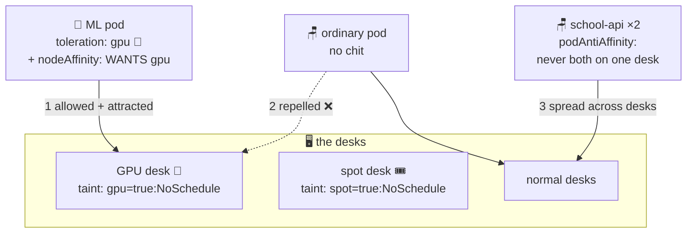

# 🎫 Lesson 20 — Taints, tolerations & affinity: assigned seating

**📍 You are here:** Lesson **20** of 26 · Previous: `lesson-19-network-policies` · Next: `lesson-21-daemonsets`

---

## 📦 What's in this branch

Everything before, **plus** steering WHICH desk each pod sits at: repel
with **taints**, permit with **tolerations**, attract with **affinity**,
separate with **anti-affinity**.

## 🧒 Explain like I'm 5

Until now the timetable-maker seated kids at any free desk. Real schools
have seating rules — two kinds:

**Signs on DESKS that push kids away** 🚫 (**taints**): the teacher's
desk has a sign: *"not for students!"* No kid may sit there… unless they
carry a matching permission chit 🎫 (a **toleration**). That's how
Kubernetes keeps normal pods off special nodes: GPU desks
(`gpu=true:NoSchedule` — only ML pods carry the chit), spot desks that
can vanish (only interruption-tolerant pods sit there — lesson 15!), and
sick desks (`NoExecute` even evicts the kids already sitting).

**Notes on KIDS about where they want to sit** 🧲 (**affinity**):
- *"I need a desk with a GPU"* — `nodeSelector` / **nodeAffinity**
  (required = hard rule; preferred = strong wish).
- *"Don't seat me next to my twin"* — **podAntiAffinity**: the two
  `school-api` copies on different desks, so one desk dying can't take
  both. (Its softer cousin `topologySpreadConstraints` — lesson 15 —
  spreads across *buildings*; anti-affinity separates across *desks*.)

Push from the desk, pull from the kid. Taints beat wishes: no chit, no
seat, ever.

## 🗺️ Diagram



## ❓ What

- **Taint** (on node): `key=value:Effect`. Effects: `NoSchedule` (hard),
  `PreferNoSchedule` (soft), `NoExecute` (also evicts — used by k8s
  itself: `node.kubernetes.io/unreachable` etc., which is HOW pods leave
  dead nodes, with `tolerationSeconds` as the grace timer).
- **Toleration** (on pod): "the sign doesn't apply to me". Tolerating ≠
  targeting — add nodeAffinity too if the pod must LAND there.
- **nodeAffinity**: `requiredDuringScheduling…` (hard) /
  `preferredDuringScheduling…` (weighted wish) on node labels.
- **podAffinity / podAntiAffinity**: seat me near / away from pods
  matching labels, within a `topologyKey` (hostname = desk, zone =
  building). Anti-affinity on `kubernetes.io/hostname` for replicas is
  the classic HA move.
- EKS reality: node groups get labels/taints in Terraform
  (`labels = { pool = "spot" }`, `taint { … }`) — seating policy as code.

## 🤔 Why

One pool of identical desks stops working the day you add GPUs, spot
instances, or a noisy batch workload next to a latency-sensitive API.
Seating rules are how ONE cluster hosts different economics (spot vs
on-demand), different hardware, and mutually-annoying tenants — without
buying separate schools.

## 🧪 Try it

```bash
NODE=$(kubectl get nodes -o jsonpath='{.items[0].metadata.name}')

# put a "wet paint" sign on the desk:
kubectl taint node $NODE wetpaint=true:NoSchedule

# ordinary pod → Pending (lesson 16 drill: describe tells you exactly why!)
kubectl -n school run nochit --image=nginxdemos/hello:plain-text
kubectl -n school describe pod nochit | grep -A3 Events | tail -3

# pod WITH the chit → seated happily:
kubectl -n school run haschit --image=nginxdemos/hello:plain-text \
  --overrides='{"spec":{"tolerations":[{"key":"wetpaint","operator":"Equal","value":"true","effect":"NoSchedule"}]}}'
kubectl -n school get pods -o wide | grep chit

# clean the sign and the kids:
kubectl taint node $NODE wetpaint=true:NoSchedule-
kubectl -n school delete pod nochit haschit
```

## ⏭️ Next

Some helpers must sit on EVERY floor, no exceptions — log collectors,
node agents: **DaemonSets**.

```bash
git checkout lesson-21-daemonsets
```
