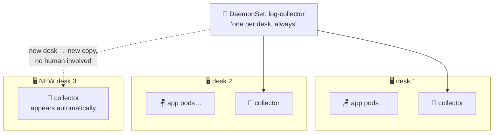

# 🧯 Lesson 21 — DaemonSets: one on every floor

**📍 You are here:** Lesson **21** of 26 · Previous: `lesson-20-taints-affinity` · Next: `lesson-22-statefulsets`

---

## 📦 What's in this branch

Everything before, **plus** the third workload shape: **DaemonSets** —
exactly one pod on EVERY node.

## 🧒 Explain like I'm 5

Fire safety rules 🧯: *"one fire extinguisher on EVERY floor."* Not "two
extinguishers somewhere in the building" — every floor, exactly one, no
exceptions. New floor built? Extinguisher appears with it. Floor
demolished? Its extinguisher goes too.

That's a **DaemonSet** — compare the three shapes you now know:

- **Deployment** (L03): *"N copies, I don't care where"* — apps.
- **StatefulSet** (next lesson): *"N copies with names and own drawers."*
- **DaemonSet**: *"one copy per DESK, matching desk count forever."*

Who needs to be on every floor? The building's own staff: the **hall-phone
wiring** (kube-proxy — how lesson 04's Services actually route!), the
**intercom installer** (the CNI plugin), **log collectors** (read every
pod's diary on that desk and ship it out — lesson 26 uses this),
**monitoring agents** (node-exporter), and security sensors. You've been
running DaemonSets since lesson 01 without knowing it. 🤯

They usually carry a fistful of tolerations (lesson 20!) — the fire
extinguisher goes on tainted floors too, even the teacher's lounge.

## 🗺️ Diagram



## ❓ What

- A DaemonSet has a pod template (like a Deployment) but **no replica
  count** — the node list IS the count. Scale-out of nodes (lesson 15's
  autoscaler!) auto-scales the daemons.
- Limit to some floors with a `nodeSelector`/affinity ("only Linux desks",
  "only GPU pool") — one-per-node *within the selection*.
- Rolling updates work like Deployments (`updateStrategy`), but think
  harder: updating a broken log agent everywhere at once hurts everywhere
  at once — `maxUnavailable: 1` is your friend.
- Daemons typically need node-level access: hostPath volumes to read
  `/var/log/containers`, sometimes host networking — which is exactly why
  RBAC (L17) and restraint matter here; a DaemonSet is on EVERY desk.

## 🤔 Why

Per-node concerns can't ride on Deployments — "N copies anywhere" might
put zero collectors on the one node whose logs you needed. DaemonSets
make node-level infrastructure declarative and self-maintaining: the
platform team's tools follow the fleet automatically as it grows, shrinks
and heals.

## 🧪 Try it

```bash
# you already run DaemonSets — meet them:
kubectl -n kube-system get daemonsets
# kube-proxy (lesson 04's routing!) + your CNI — DESIRED == number of nodes

# a toy extinguisher on every floor:
kubectl -n school apply -f - <<'EOF'
apiVersion: apps/v1
kind: DaemonSet
metadata: { name: floor-watch }
spec:
  selector: { matchLabels: { app: floor-watch } }
  template:
    metadata: { labels: { app: floor-watch } }
    spec:
      containers:
        - name: watch
          image: busybox
          command: ["sh","-c","echo watching floor $(hostname); sleep infinity"]
          resources: { requests: { cpu: 10m, memory: 16Mi } }
EOF
kubectl -n school get ds,pods -o wide | grep floor
# multi-node cluster? one pod PER node. minikube: one node, one pod —
#   `minikube node add` and watch a second appear by itself 🎉
kubectl -n school delete ds floor-watch
```

## ⏭️ Next

Pods with NAMES and their own drawers — running a database inside the
cluster, properly: **StatefulSets**.

```bash
git checkout lesson-22-statefulsets
```
