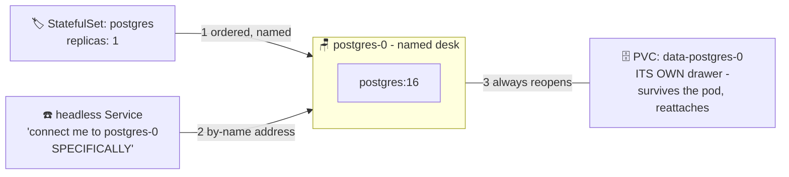

# 🏷️ Lesson 22 — StatefulSets: desks with name plates

**📍 You are here:** Lesson **22** of 26 · Previous: `lesson-21-daemonsets` · Next: `lesson-23-qos-evictions`

---

## 📦 What's in this branch

Everything before, **plus** the workload shape lesson 12 only waved at —
now hands-on. Real file:

- [k8s/postgres-statefulset.yaml](../../k8s/postgres-statefulset.yaml) — a real Postgres with its own drawer (for learning; prod stance unchanged: RDS)

## 🧒 Explain like I'm 5

Deployment kids are **interchangeable** — new kid, new random name
(`school-api-7d9f8-xk2lp`), any desk, shared reception number. Perfect
for stateless work; useless for a database. A database kid needs:

1. **A name plate** 🏷️: `postgres-0`. Dies? The replacement is *also*
   `postgres-0` — same name, same identity, addressable directly as
   `postgres-0.postgres` (via a **headless Service** — reception that
   transfers you to a SPECIFIC kid instead of "whoever's free").
2. **Their own drawer** 🗄️: `volumeClaimTemplates` mints a personal PVC
   per pod — `postgres-0` always reopens *its own* drawer (lesson 12's
   library shelf, now with the kid's name engraved). Deleting the pod
   never deletes the drawer.
3. **Order** 📶: kids arrive one at a time (`-0`, then `-1`, then `-2`)
   and leave in reverse — replicated databases need the firstborn ready
   before the followers copy from it.

That trio — sticky name, sticky drawer, ordered arrival — is the entire
difference between a StatefulSet and a Deployment.

## 🗺️ Diagram



## ❓ What

- `serviceName:` points at a **headless** Service (`clusterIP: None`) —
  DNS gives each pod a stable per-name address instead of load-balancing.
- `volumeClaimTemplates:` — the personal-drawer mint. On EKS these become
  EBS volumes, and lesson 15's warning applies: **a drawer lives in ONE
  building (AZ)** — `postgres-0` reschedules only where its drawer is.
- Updates roll in reverse order, one by one; scaling down detaches
  drawers but keeps them (rejoining kids find their stuff).
- Honest scope: ONE StatefulSet ≠ high availability. Real replication/
  failover needs an **operator** (CloudNativePG etc. — lesson 25 explains
  what operators are). This repo's production stance stands: **rent the
  library (RDS)**; run StatefulSets to *understand* them, or for
  dev/test.

## 🤔 Why

Because "can we run the database in the cluster?" is asked in every team,
and now you can answer precisely: here's what k8s gives you (identity,
storage, order), here's what it doesn't (replication, failover, backups —
the operator's or RDS's job), and here's why lesson 12 chose RDS. Knowing
the machinery is what makes the "rent it" advice credible.

## 🧪 Try it

```bash
kubectl apply -f k8s/postgres-statefulset.yaml
kubectl -n school get pods -w                    # postgres-0 — THE name; Ctrl+C
kubectl -n school get pvc                        # data-postgres-0 — THE drawer

# write something, then kill the kid:
kubectl -n school exec postgres-0 -- psql -U school -c "CREATE TABLE proof(id int); INSERT INTO proof VALUES (42);"
kubectl -n school delete pod postgres-0          # 💥
kubectl -n school get pods -w                    # postgres-0 returns (same name!); Ctrl+C

# same drawer, data intact:
kubectl -n school exec postgres-0 -- psql -U school -c "SELECT * FROM proof;"   # 42 🎉

# cleanup (drawer is kept on purpose — delete it explicitly):
kubectl delete -f k8s/postgres-statefulset.yaml
kubectl -n school delete pvc data-postgres-0
```

## ⏭️ Next

When a desk runs out of lunch, who gets asked to leave first? **QoS
classes & evictions** — the pecking order you're already in without
knowing it.

```bash
git checkout lesson-23-qos-evictions
```
