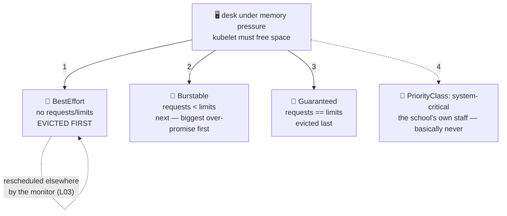

# 🍽️ Lesson 23 — QoS classes & evictions: who leaves when lunch runs short

**📍 You are here:** Lesson **23** of 26 · Previous: `lesson-22-statefulsets` · Next: `lesson-24-cluster-upgrades`

---

## 📦 What's in this branch

Everything before, **plus** the pecking order every pod is already in
without knowing it — **QoS classes** — and what happens when a desk runs
out of memory: **evictions**.

## 🧒 Explain like I'm 5

Lesson 08's canteen had promised plates (requests) and portion caps
(limits). Here's the part nobody mentions until the food actually runs
out: **the kitchen ranks the kids.** 🍽️

- **Guaranteed** 🥇 — kids whose promise EQUALS their cap
  (`requests == limits`, both CPU & memory). The kitchen knows exactly
  what they'll eat. Asked to leave **last**.
- **Burstable** 🥈 — a promise, plus permission for seconds
  (`requests < limits`). Our school-api pods live here.
- **BestEffort** 🥉 — walked in with **no promise at all** (no requests,
  no limits). Eats whatever's lying around… and when the pantry runs low,
  they're asked to leave **first**. Every `kubectl run` without resources
  makes one of these!

When a desk runs low on memory (**node pressure**), the kubelet starts
**evicting**: BestEffort first, then Burstable eating over its promise,
Guaranteed last. Eviction is polite-ish (pod rescheduled elsewhere —
lesson 03's monitor handles it); the impolite cousin is the instant
**OOMKill** (lesson 08) when one container bursts past its own cap.

VIP passes exist too: **PriorityClasses** — system pods carry
`system-node-critical` so the school's own staff is never asked to leave
before the students.

## 🗺️ Diagram



## ❓ What

- QoS is **computed, not declared** — set requests/limits (L08) and the
  class follows. Check: `kubectl get pod X -o jsonpath='{.status.qosClass}'`.
- Eviction ≠ OOMKill: eviction = kubelet freeing a *node* under pressure
  (pod status `Evicted`, rescheduled); OOMKill = kernel enforcing one
  container's own limit (exit 137, restarts in place).
- Order under pressure: BestEffort → Burstable (usage furthest above
  requests first) → Guaranteed; PriorityClass outranks QoS for the tie-breaks.
- Practical stance: databases/critical singletons → Guaranteed; normal
  apps → honest Burstable; BestEffort → never in production (it's the
  first sacrifice AND invisible to the scheduler's math from L08).

## 🤔 Why

"Random pod disappeared at peak traffic" is this lesson, every time. QoS
is also lesson 08's missing second half: requests don't just place pods —
they're the *survival ranking* when things get tight. Five minutes spent
setting honest requests buys you predictable behavior on the worst day.

## 🧪 Try it

```bash
# what class are OUR pods? (requests<limits → Burstable)
kubectl -n school get pods -o custom-columns='NAME:.metadata.name,QOS:.status.qosClass'

# make one of each and compare:
kubectl -n school run best --image=busybox -- sleep 3600
kubectl -n school run guar --image=busybox \
  --overrides='{"spec":{"containers":[{"name":"guar","image":"busybox","command":["sleep","3600"],
    "resources":{"requests":{"cpu":"50m","memory":"64Mi"},"limits":{"cpu":"50m","memory":"64Mi"}}}]}}'
kubectl -n school get pods best guar -o custom-columns='NAME:.metadata.name,QOS:.status.qosClass'
# best → BestEffort 🥉 · guar → Guaranteed 🥇

kubectl -n school delete pod best guar
# (real evictions need real node pressure — don't simulate on your laptop;
#  instead read any prod cluster's story: kubectl get events -A | grep -i evict)
```

## ⏭️ Next

Renovating classrooms while school stays open: **cluster upgrades** —
where cordon, drain, and lesson 15's PDBs finally perform together.

```bash
git checkout lesson-24-cluster-upgrades
```
