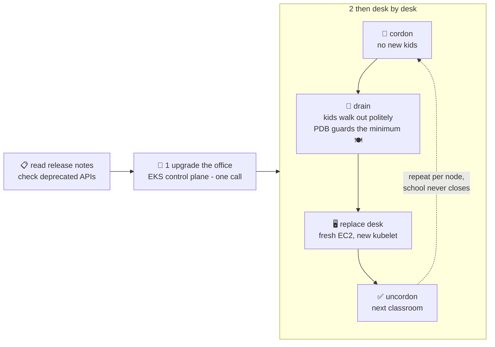

# 🏗️ Lesson 24 — Cluster upgrades: renovating while school stays open

**📍 You are here:** Lesson **24** of 26 · Previous: `lesson-23-qos-evictions` · Next: `lesson-25-crds-operators`

---

## 📦 What's in this branch

Everything before, **plus** the chore every cluster owner meets ~3 times a
year: **upgrading Kubernetes itself** without closing the school.

## 🧒 Explain like I'm 5

Kubernetes ships a new version three times a year, and old versions stop
getting patches — so upgrading isn't optional, it's **scheduled
renovation** 🏗️. The renovation rules:

1. **Office first, classrooms second.** 🏢 Upgrade the control plane
   (EKS: one API call/Terraform change — AWS renovates its own office
   invisibly), THEN the desks. Never the other way: kubelets may be a
   little OLDER than the office, never newer (the "version skew" rule).
2. **One classroom at a time, kids relocated politely.** For each desk:
   - **cordon** 🚧 — tape on the door: *"no NEW kids seated here"*
     (`kubectl cordon` — running kids stay put);
   - **drain** 🚚 — walk the kids out to other desks
     (`kubectl drain` — pods rescheduled; lesson 03's monitor rebuilds
     them elsewhere);
   - replace the desk (managed node groups: a fresh EC2 desk with the
     new kubelet — cattle, not renovated pets! AWS course L12);
   - **uncordon** — tape off, next classroom.
3. **The PDBs finally perform.** 🍽️ Lesson 15's PodDisruptionBudget is
   exactly what makes draining safe: *"never both school-api kids out at
   once"* — the drain WAITS at each step until the class is covered.
   No PDB = a drain can empty your app for a moment. Now you know why we
   set one.
4. **Small steps only**: one minor version at a time (1.31→1.32→1.33),
   staging cluster first, read the release notes for removed APIs (the
   classic breakage: a manifest using an apiVersion that's gone).

## 🗺️ Diagram



## ❓ What

- **Skew rule**: kubelet may trail the API server by up to 3 minor
  versions, but never lead it. Upgrade order: control plane → nodes →
  (then add-ons: CNI, CoreDNS, kube-proxy — EKS lists compatible
  versions per release).
- **EKS flow**: bump `cluster_version` in Terraform → control plane
  upgrades in place (still multi-AZ, no downtime) → update the node
  group's AMI/version → EKS rolls desks using exactly
  cordon-drain-replace, respecting your PDBs.
- `kubectl drain` flags you'll actually need:
  `--ignore-daemonsets` (extinguishers stay bolted to the floor — L21)
  and `--delete-emptydir-data` (scratch shelves don't survive anyway).
- Watch out: single-replica apps (nothing to relocate TO — brief
  downtime), StatefulSets whose drawer pins them to a zone (L22), and
  PDBs set so strict the drain can never proceed (minAvailable = replicas
  → deadlock 😅).

## 🤔 Why

Clusters that skip upgrades become unpatchable museums, and the eventual
forced triple-jump upgrade is a weekend of terror. Teams that upgrade
often make it boring — because every mechanism in this course (monitor,
probes, PDB, multi-AZ, cattle-desks) exists precisely so that a desk can
vanish at any moment *on purpose*. An upgrade is just scheduled chaos.

## 🧪 Try it (safe on any local cluster)

```bash
kubectl version | head -2                       # office vs desk versions
NODE=$(kubectl get nodes -o jsonpath='{.items[0].metadata.name}')

kubectl cordon $NODE                            # 🚧 tape on the door
kubectl get nodes                               # SchedulingDisabled
kubectl -n school run newkid --image=busybox -- sleep 300
kubectl -n school get pod newkid                # Pending — no desk accepts new kids!

kubectl uncordon $NODE                          # tape off
kubectl -n school get pod newkid -w             # seated 🎉  (Ctrl+C)
kubectl -n school delete pod newkid

# multi-node clusters only — feel a real drain (watch the PDB hold the line):
# kubectl drain $NODE --ignore-daemonsets --delete-emptydir-data
# kubectl uncordon $NODE
```

## ⏭️ Next

How Kubernetes learns entirely NEW words — the mechanism behind ArgoCD's
`Application` and half the cloud-native world: **CRDs & operators**.

```bash
git checkout lesson-25-crds-operators
```
