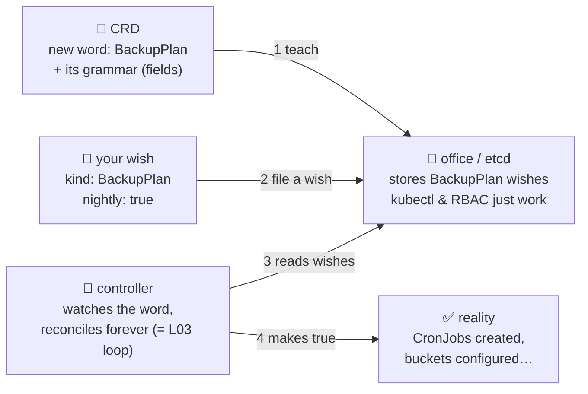

# 🤖 Lesson 25 — CRDs & operators: teaching the office new words

**📍 You are here:** Lesson **25** of 26 · Previous: `lesson-24-cluster-upgrades` · Next: `lesson-26-observability`

---

## 📦 What's in this branch

Everything before, **plus** the extension mechanism behind half the
cloud-native world: **CustomResourceDefinitions** and the **operator
pattern**.

## 🧒 Explain like I'm 5

The school office (L13) speaks a fixed dictionary: Pod, Deployment,
Service… But here's Kubernetes' deepest trick — **you can teach it new
words** 📖✨:

1. **Add the word to the dictionary** (a **CRD**): *"there is now a thing
   called `BackupPlan`, and here's what its fields mean."* Instantly,
   `kubectl get backupplans` works, wishes get stored in the register
   (etcd), RBAC can gate them (L17)… and **absolutely nothing else
   happens.** A word with no one who understands it is just filed
   paperwork.
2. **Hire a robot who acts on the word** (a **controller**): it watches
   the register for `BackupPlan` wishes and endlessly makes reality match
   — the SAME reconcile loop as lesson 03's class monitor, just for a
   word you invented.

**CRD + controller + baked-in expertise = an operator** — a robot
employee that runs software *the way a human expert would*:

- You've already USED one: ArgoCD! `Application` is a CRD; its
  controller is the caretaker robot. That "one more Application file"
  workflow? This mechanism.
- **cert-manager**: wish for a `Certificate` → robot obtains and renews
  TLS forever.
- **CloudNativePG**: wish for a `Cluster` (Postgres, 3 replicas) → robot
  does replication, failover, backups — the "hire the librarian INSIDE
  the school" answer L22 pointed at.

The pattern to remember: *in Kubernetes, everything — built-in or
invented — is a word in the register plus a robot who makes it true.*

## 🗺️ Diagram



## ❓ What

- A **CRD** defines group/version/kind + an OpenAPI schema (validation
  for free). Instances ("custom resources") behave like any object:
  YAML, GitOps-able (the ArgoCD course deploys CRs happily), RBAC-able.
- **Controllers** are just programs (usually in-cluster Deployments)
  using the watch API; write your own with kubebuilder/operator-sdk when
  you're ready — or never, most teams only *consume* operators.
- Operators shine for stateful/expert software (databases, queues,
  certs, service meshes). Judge before installing: it's cluster-admin-ish
  software you must upgrade (L24) and monitor (L26) — the trade-offs page
  applies!
- Spot them in the wild: `kubectl get crds` after installing anything
  interesting — ArgoCD alone teaches the office several new words.

## 🤔 Why

This is the answer to "why does everyone build ON Kubernetes instead of
NEXT to it": one register, one reconcile pattern, one CLI, one RBAC — for
every concept anyone ever invents. Understanding CRDs turns tools like
ArgoCD, cert-manager and CloudNativePG from magic into "a word plus a
robot" — and that mental model is the real graduation.

## 🧪 Try it — teach a word with NO robot, and feel the silence

```bash
kubectl apply -f - <<'EOF'
apiVersion: apiextensions.k8s.io/v1
kind: CustomResourceDefinition
metadata: { name: backupplans.school.example.com }
spec:
  group: school.example.com
  scope: Namespaced
  names: { kind: BackupPlan, plural: backupplans, singular: backupplan }
  versions:
    - name: v1
      served: true
      storage: true
      schema:
        openAPIV3Schema:
          type: object
          properties:
            spec:
              type: object
              properties:
                nightly: { type: boolean }
EOF

kubectl apply -f - <<'EOF'
apiVersion: school.example.com/v1
kind: BackupPlan
metadata: { name: my-wish, namespace: school }
spec: { nightly: true }
EOF

kubectl -n school get backupplans          # your word, first-class citizen!
# ...and nothing else happens, ever — no robot knows the word. THAT gap
# (wish stored ≠ wish fulfilled) is exactly what a controller fills. 🤖

kubectl -n school delete backupplan my-wish
kubectl delete crd backupplans.school.example.com
```

## ⏭️ Next

The final lesson: can you actually SEE all of this running? Report
cards, diaries and alarm bells: **observability**.

```bash
git checkout lesson-26-observability
```
