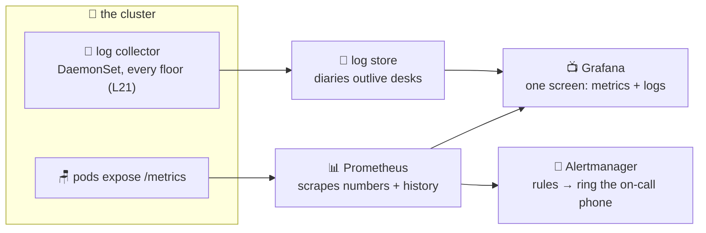

# 📈 Lesson 26 — Observability: report cards, diaries and alarm bells

**📍 You are here:** Lesson **26** of 26 — the final lesson! · Previous: `lesson-25-crds-operators`

---

## 📦 What's in this branch

The complete course — all 26 lessons. The finale: how you actually **see**
a running cluster: the three signals, the standard tools, and what "good
enough" looks like.

## 🧒 Explain like I'm 5

A school you can't observe is a school run on rumors. Three kinds of
paperwork fix that:

1. **Report cards** 📊 (**metrics**) — numbers over time: how much CPU is
   each kid using? requests per second? pods Pending? You've met the
   junior version: **metrics-server** (it feeds `kubectl top` and the
   HPA, L09). The grown-up version is **Prometheus**: every few seconds
   it walks the school and copies numbers off every door (`/metrics`),
   filing them with history — so you can ask "what was it doing at 2 AM
   *yesterday*?"
2. **Diaries** 📜 (**logs**) — what each kid wrote (`kubectl logs`, L16).
   One problem at scale: diaries die with the desk! So a collector on
   every floor (**a DaemonSet!** — L21) ships every diary to the library
   (Loki, CloudWatch Logs, Elasticsearch) where they outlive pods and
   are searchable across the whole school.
3. **Alarm bells** 🔔 (**alerts**) — nobody stares at dashboards at 3 AM.
   Rules watch the metrics: *"fewer ready pods than desired for 5 min →
   ring the on-call phone."* (Alertmanager, or CloudWatch alarms.)

Plus the fancy fourth: **traces** 🧵 — one request's journey stitched
across services (gate → api → analytics → db), for "WHERE was it slow?".
Meet it when you have more services than fingers.

The classic starter kit: **kube-prometheus-stack** (Prometheus + Grafana
+ Alertmanager, installed via Helm — ArgoCD course L11 — and yes, it's
operators + CRDs all the way down — L25 🤯).

## 🗺️ Diagram



## ❓ What

- **metrics-server vs Prometheus**: live-now numbers for HPA/`top` vs
  full history + query language (PromQL) + alerting. You want both.
- The four questions a minimal setup must answer: is the app **up**
  (probes ready)? is it **erroring** (HTTP 5xx rate)? is it **slow**
  (latency)? is the cluster **healthy** (Pending pods, node pressure —
  L23's evictions show up here first!).
- **Golden alerts to start with**: deployment ready-replicas below
  desired; pod restart-looping; node NotReady; PVC almost full; job
  failed (your backup bell from L18!).
- On EKS the rent-don't-run option is **CloudWatch Container Insights** —
  fewer knobs, one bill; the trade-offs page's logic applies as always.
- Costs live in cardinality and retention: keep 15 days hot, ship the
  rest cold, and don't label metrics with unbounded values (user IDs 😱).

## 🤔 Why

Every earlier lesson gave the cluster a *behavior*; observability is how
you find out **which one is happening right now**. It's also the
difference between lesson 16's drill starting from evidence versus from
panic — and between discovering the backup failed tonight or discovering
it the day you needed the backup.

## 🧪 Try it

```bash
# the junior report card you already have:
kubectl top nodes && kubectl -n school top pods        # (metrics-server, L09)

# what Prometheus would scrape — peek at a real /metrics page:
kubectl -n school port-forward deploy/school-api 3000:3000 &
curl -s localhost:3000/metrics | head -20 2>/dev/null \
  || echo "no /metrics endpoint — apps expose one via client libraries (prom-client for Node)"
kill %1

# the full stack, one command (needs Helm; ~2 min, laptop-friendly):
helm repo add prometheus-community https://prometheus-community.github.io/helm-charts
helm install obs prometheus-community/kube-prometheus-stack -n monitoring --create-namespace
kubectl -n monitoring port-forward svc/obs-grafana 3001:80 &
# open http://localhost:3001 (admin / prom-operator) → dashboards for
# YOUR cluster: nodes, pods, the works. 📺  Uninstall: helm uninstall obs -n monitoring
```

## 🎓 The whole school, complete

Lunchboxes → desks → monitors → reception → rooms → notice boards →
probes → portions → buses → gates → substitutions → shelves → the office
→ deploy robots → many buildings → the nurse's drill → hall passes →
homework bells → notes rules → assigned seats → extinguishers → name
plates → lunch rankings → renovations → new words → and now: eyes on all
of it. **Twenty-six lessons. You don't just use Kubernetes anymore — you
can run it, debug it, secure it, upgrade it and watch it breathe.** 🎓

```bash
git checkout main   # and go run something real
```
